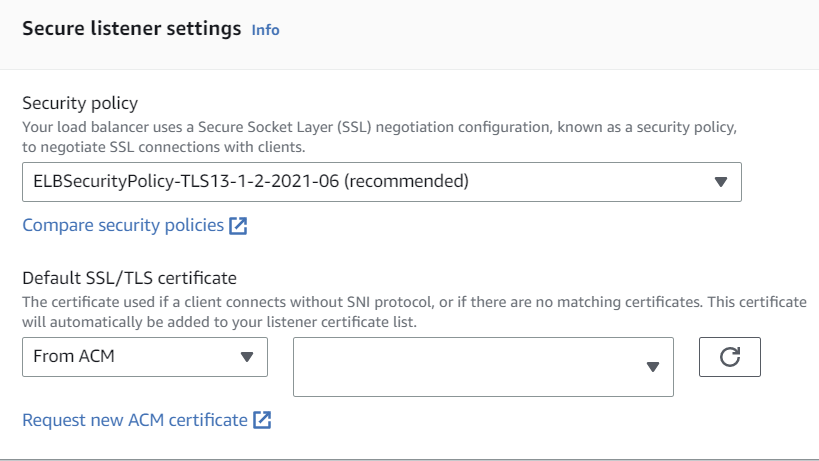
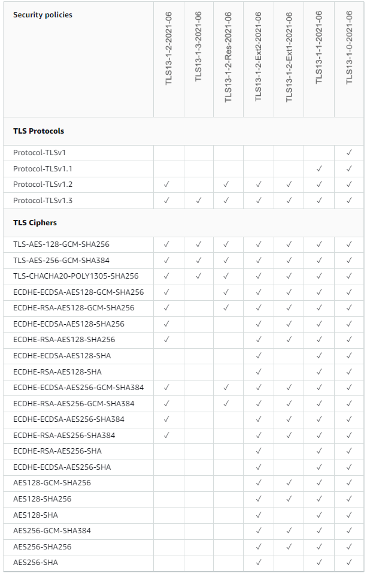
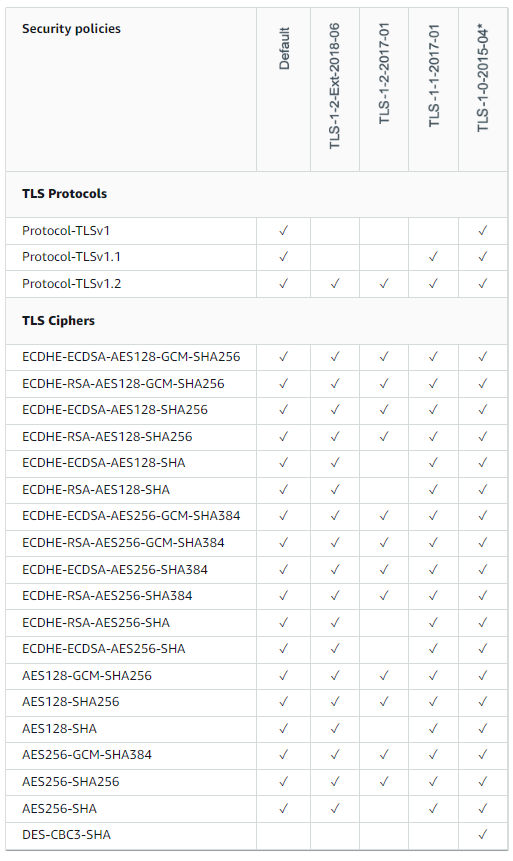

> ❗ Translations provided by machine translation.

Finally, AWS Application Load Balancer supports TLS 1.3.  
Back in 2021, Network Load Balancer supported TLS 1.3 (Security Policy: ELBSecurityPolicy-TLS13-1-2-2021-06).  

Now, two years later, Application Load Balancer supports TLS 1.3.  
It's not reflected in the official blog or AWS documentation yet, but if you check the AWS console, you can see the Security Policy has been added to support TLS 1.3.  

## How to configure
1. select Load Balancer in the AWS Console.
2. Select a Listener to configure.
3. select Security Policy from Listener Details.
4. select ELBSecurityPolicy-TLS13-1-2-2021-06.  

{: width="70%" height="70%"}

## Security Policy  
In AWS ALB, you can select a predefined Security Policy to select the TLS version and Cipher suite.   

### TLS1.3 Policy
{: width="60%" height="60%"}

### TLS1.2 Policy
{: width="60%" height="60%"}

ALB's documentation hasn't been updated yet, so you can refer to NLB's documentation.  
(https://docs.aws.amazon.com/elasticloadbalancing/latest/network/create-tls-listener.html#describe-ssl-policies)

## Why should I use TLS 1.3?
TLS 1.3 is a protocol that improves performance while maintaining the security of TLS 1.2.
It removes the vulnerable cipher suites used in TLS 1.2 (MD5, SHA1, RC4, 3DES, etc.) and optimizes cipher suite negotiation.  

By optimizing cipher suite negotiation, TLS 1.3 supports 0-RTTs.
Of course, 0-RTT can be vulnerable to replay attacks.

Here's a good article from Cloudflare that explains 0-RTT in TLS1.3.  
(https://blog.cloudflare.com/introducing-0-rtt/)

## Quadruped  
Of AWS, Azure, and GCP, only GCP supports TLS 1.3 at the load balancer end.  
As a frequent user of Azure AWS, this was disappointing.  

In particular, GCP can easily apply HTTP/3 to CDNs and load balancers, so I thought it would be a good choice to apply the latest technology (it's a Google-driven protocol, right?).  
I also realized that we were late to the game, as it's only been three years since AWS ALB made end-to-end HTTP/2 possible.