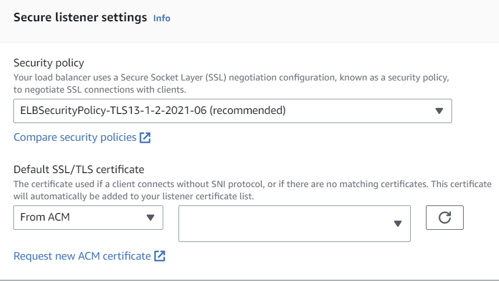

드디어, AWS Application Load Balancer가 TLS 1.3을 지원합니다.  
2021년에 Network Load Balancer가 TLS 1.3을 지원했었는데요.  (Security Policy: ELBSecurityPolicy-TLS13-1-2-2021-06)  

2년이 지난 지금, Application Load Balancer도 TLS 1.3을 지원합니다.  
아직 공식블로그나 AWS 공식문서에는 반영되지 않았지만, AWS 콘솔로 확인해보면 TLS 1.3을 지원하는 Security Policy가 추가되어 있습니다.

## 설정방법
1. AWS 콘솔에서 Load Balancer를 선택합니다.
2. 설정할 Listener를 선택합니다.
3. Listener Details에서 Security Policy를 선택합니다.
4. ELBSecurityPolicy-TLS13-1-2-2021-06을 선택합니다.  

{: width="70%" height="70%"}

## Security Policy  
AWS ALB에서는 사전에 정의된 Security Policy를 선택하여, TLS 버전 및 Cipher suite를 선택할 수 있습니다.  

### TLS1.3 Policy
{: width="60%" height="60%"}

### TLS1.2 Policy
{: width="60%" height="60%"}

아직 ALB의 문서가 업데이트 되지 않아, NLB의 문서를 참고하시면 됩니다.  
(https://docs.aws.amazon.com/elasticloadbalancing/latest/network/create-tls-listener.html#describe-ssl-policies)

## 왜 TLS 1.3을 써야하는가?
TLS 1.3은 TLS 1.2의 보안성을 유지하면서, 성능을 향상시킨 프로토콜입니다.
TLS 1.2에서 사용하던 취약한 Cipher suite을 제거하였고 (MD5, SHA1, RC4, 3DES 등)  

Ciper suite negotiation을 최적화하여, TLS 1.3에서는 0-RTT를 지원합니다.
물론 이런 0-RTT는 Replay Attack에 취약할 수 있습니다.

TLS1.3의 0-RTT 관련, 잘 설명된 Cloudflare의 글을 공유합니다.
(https://blog.cloudflare.com/introducing-0-rtt/)

## 사족  
AWS, Azure, GCP 중에서 GCP만이 로드밸런서 단에서 TLS 1.3을 지원하고 있었습니다.  
Azure AWS를 자주 사용하는 입장에서는 아쉬웠는데요.  

특히 GCP는 HTTP/3를 CDN 및 로드밸런서에 쉽게 적용할 수 있어서, 최신 기술을 적용하기에 좋겠다는 생각이 들었습니다.(구글이 주도한 프로토콜이니까, 당연한걸까요?)  
또한 AWS ALB로 End-to-End HTTP/2가 가능해진지 3년밖에 되지 않는등, 새로운 기술을 적용하기에 늦은 편이라는 생각이 들었습니다.
