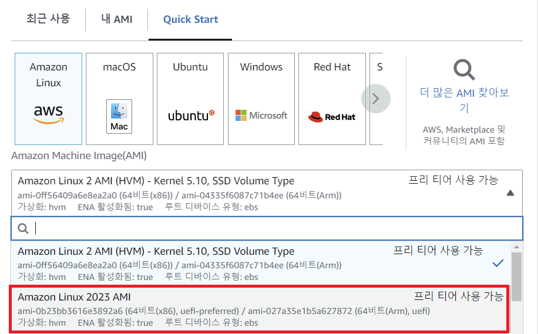

몇일전에 Amazon Linux 2023의 RC관련 포스팅을 올렸는데요.  
오늘 정식 출시되었습니다.  

릴리즈 링크는 아래와 같습니다.  
[https://aws.amazon.com/ko/about-aws/whats-new/2023/03/amazon-linux-2023/](https://aws.amazon.com/ko/about-aws/whats-new/2023/03/amazon-linux-2023/)

지난 포스팅에서 대략적으로 Amazon Linux 2023의 변경점을 알아보았는데요.  
[비교표](https://shblue21.github.io/aws/Amazon-linux-2022-RC%EC%B6%9C%EC%8B%9C/#%EC%A3%BC%EC%9A%94-%EB%B9%84%EA%B5%90-%EC%82%AC%ED%95%AD)

패키지매니저 및 Base OS등 변경점이 많아, 도입에 주저하실 수도 있으나  
신규로 프로비저닝을 하실때는 Amazon Linux 2023을 사용하시는 것을 권장합니다.

{: width="70%" height="70%"}  

