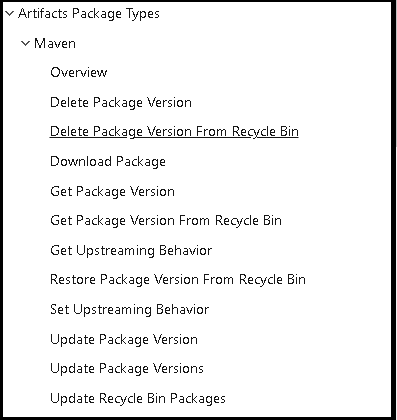
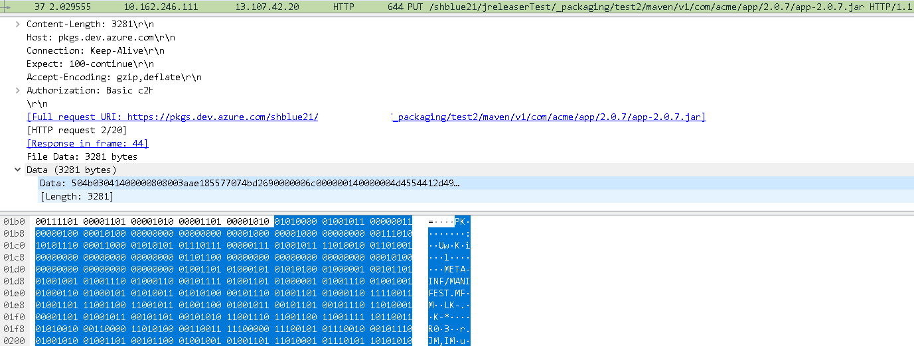

> 주의: Azure devops 에서 공식적으로 지원하는 방법은 아닙니다.

Azure Devops는 훌륭한 Devops 도구다. 많은 오픈소스 프로젝트에게 거의 무료로 지원해주어서  
많은 오픈 소스가 Azure Devops를 사용하고 있다. (특히 CI/CD, Azure Pipline) 
물론 최근에는 Github Action으로 많이 이동하는 추세다.

Azure Devops는 Borad(칸반), Repos(형상관리), Pipelines(CI/CD, Test), Artifacts 등 여러 기능을 통합 형태 인데,  

그중 Azure Artifact는 Azure Devops에서 제공하는 Artifact 저장소이지만, 공식적으로 Rest API로 Publish 하는 방법은 제공하지 않는다.  

이 문서는 Azure Artifact Maven Feed에 대해 Rest API로 Publish 하는 방법을 설명한다.(비공식)

## 정말 Rest API로 Publish를 지원하지 않는가?  

그렇다 많은 Artifactory, JFrog등 Artifact 서비스는 Rest API로 Publish를 지원하지만(심지어 AWS CodeArtifact도 지원한다), Azure Devops Rest API로 Publish 할 수 없다.  

  
(공식 문서에 Publish 혹은 Upload 하는 REST API가 없음.)

그러나 방법이 없는 것은 아니다. 공식적으로 지원하진 않지만, 하기 서술 하는 방법을 이용하면 Rest API로 Publish 할 수 있다.


## Azure Artifact Maven Feed에 Rest API로 Publish 하는 방법
> PUT https://pkgs.dev.azure.com/{organization}/{project}/_packaging/{feed}/maven/v1/{groupId}/{artifactId}/{version}/{artifactId}-{version}.jar
  
PUT 메소드로 https://pkgs.dev.azure.com/{organization}/{project}/_packaging/{feed}/maven/v1/{groupId}/{artifactId}/{version}/{artifactId}-{version}.jar 로 요청한다.
Body에는 jar혹은 라이브러리 파일을 byte array로 전달한다.  

  
WireShark로 확인한 Rest API 호출


## Java를 쓰다면, Azure Devops SDK를 사용해라.
상기와 같은 방법으로 라이브러리를 REST API로 업로드할 수 있다. 혹은 오픈소스인 Java 기반의 Azure Devops SDK의 uploadPackage 메소드를 사용할 수 있다.

- Url : https://github.com/hkarthik7/azure-devops-java-sdk

```java
// MavenDetilas.java
void uploadPackage(String feedId, String groupId, String artifactId, String version, String fileName, InputStream content) throws AzDException;

// using example
mvn.uploadPackage(FEED, TEST1_GROUP, TEST1_ARTIFACT, uploadVersion, uploadFileName, inputStream);
 
```


