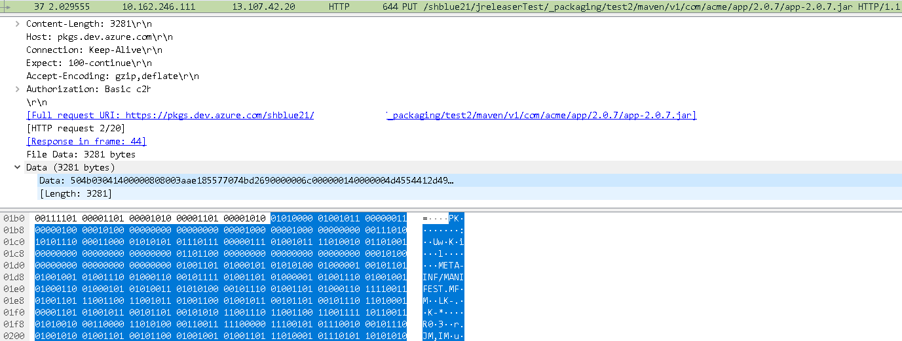

> ❗ Translations provided by machine translation.  
> Note: This is the method officially supported by Azure devops.

Azure Devops is a great Devops tool. It provides almost free support to many open source projects.  

Many open sources are using Azure Devops. (especially CI/CD, Azure Pipline)
Of course, recently, a lot of people are moving to Github Action.  

Azure Devops is an integrated form of several functions such as Borad (Kanban), Repos (shape management), Pipelines (CI/CD, Test), and Artifacts.  

Among them, Azure Artifact is an Artifact repository provided by Azure Devops, but does not provide a way to officially publish with Rest API.  

This document describes how to publish with Rest API for Azure Artifact Maven Feed (unofficial).  


## Does it really not support Publish as Rest API?

Yes, many Artifact services such as Artifactory and JFrog support Publish with Rest API (even AWS CodeArtifact supports it), but you cannot publish with Azure Devops Rest API.  

  
(There is no REST API to publish or upload in the official document.)

But that doesn't mean there isn't a way. Although it is not officially supported, you can publish with Rest API by using the method described below.


## How to publish as Rest API to Azure Artifact Maven Feed
> PUT https://pkgs.dev.azure.com/{organization}/{project}/_packaging/{feed}/maven/v1/{groupId}/{artifactId}/{version}/{artifactId}-{version }.jar
  
PUT method as https://pkgs.dev.azure.com/{organization}/{project}/_packaging/{feed}/maven/v1/{groupId}/{artifactId}/{version}/{artifactId}-{version}.jar to request.  
A jar or library file is delivered to the body as a byte array.

  
WireShark capture of Rest API request


## If you use Java, use the Azure Devops SDK.
In the same way as above, the library to be uploaded can be uploaded to the REST API. Alternatively, you can use the uploadPackage method of the open source Java-based Azure Devops SDK. 

- Url : https://github.com/hkarthik7/azure-devops-java-sdk


```java
// MavenDetilas.java
void uploadPackage(String feedId, String groupId, String artifactId, String version, String fileName, InputStream content) throws AzDException;

// using example
mvn.uploadPackage(FEED, TEST1_GROUP, TEST1_ARTIFACT, uploadVersion, uploadFileName, inputStream);
 
```
