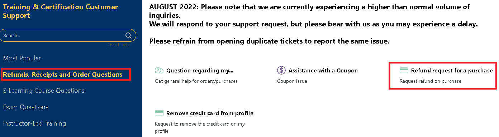
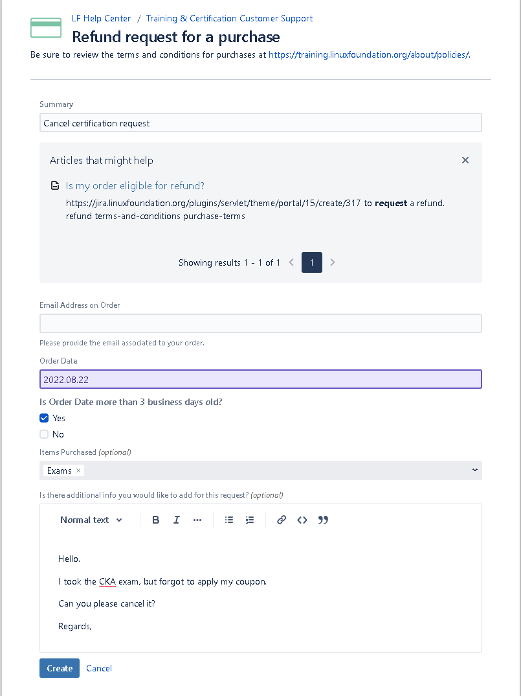
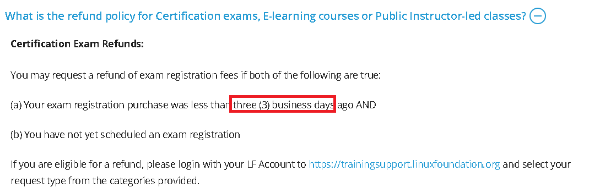

> ❗ Translations provided by machine translation.  

> You can get a refund from [Customer Support](https://pages.awscloud.com/GLOBAL-ln-GC-TrainCert-Cloud-Practitioner-Challenge-2022-reg.html) within **3 business days**.

While many overseas IT accredited tests can be conducted at $100 to $200,  
The Kubernetes test (CKA, CKAD, CKS), organized by the Linux Foundation and certified by the CNCF, is quite expensive at $395 (KRW 550,000 as of August 202)  

If you use Coupon, you can get a discount about 35%  
If you register for the test without knowing this, you will take the test at a loss of about **180,000 won** based on KRW (as of August 202)  

If the test needs to be canceled due to Coupon re-application or other reasons, the Kubernetes test cannot be cancelled** with the **System and must be disconnected from **Ticket**.  
I will guide you on how to cancel the test below.  

### How to cancel the examination
1. Go to [Customer Support](https://jira.linuxfoundation.org/plugins/servlet/theme/portal/15/group/71) and select ***Refund request for a purchase**.  
  
2. Complete the request by entering the subject, the email address you ordered, the date you ordered, and a brief form.  

3. An email will be sent when the ticket is processed.  

### etc
- As stated in the Support Portal, trial refunds are available within **3 Business Days**.  
  
- It may take 5-10 days for the actual payment to be canceled.