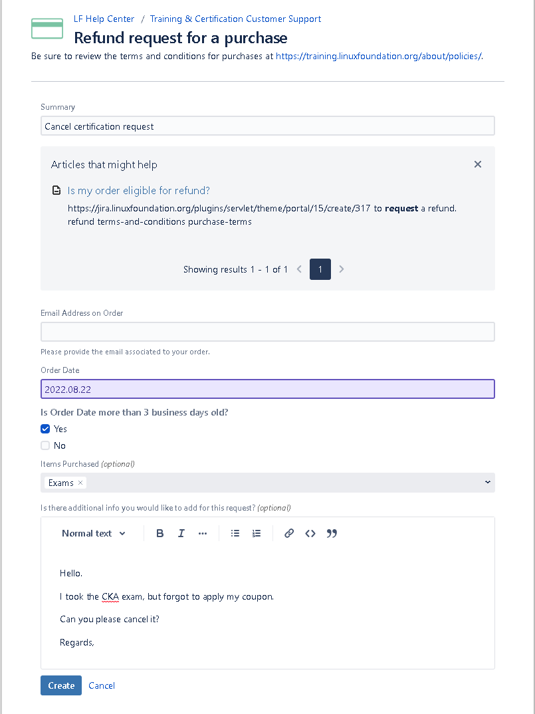

> [Customer Support](https://pages.awscloud.com/GLOBAL-ln-GC-TrainCert-Cloud-Practitioner-Challenge-2022-reg.html)에서 **3영업일** 내에 Refund 받을 수 있습니다.

많은 해외 IT 공인시험들이 $100 ~ $200 정도로 치룰 수 있는 반면에,  
Linux Foundation에서 주관하고 CNCF에서 공인하는 Kubernetes 시험(CKA, CKAD, CKS)은 $395로 꽤 비싼 시험입니다.(22년 8월 기준 55만원)  

Coupon을 사용하면 대략 35%정도 Discount를 받을 수 있는데,
이를 모르고 시험을 Register 한 경우 한화 기준 약 **18만원**을 손해보고 시험을 치루게 됩니다.(22년 08월 기준)  

Coupon 재적용 혹은 그외 사유로 시험을 취소해야 하는 경우, Kubernetes 시험은 **시스템으로 Cancelation** 할 수 없고, **Ticket**을 끊어 처리해야 합니다.  
하기에 시험 취소 방법에 대해 Guide 합니다.

### 시험 취소 방법
1. [Customer Support](https://jira.linuxfoundation.org/plugins/servlet/theme/portal/15/group/71)에 접속하여, ***Refund request for a purchase**를 선택합니다.  
  
2. 제목과, 주문한 이메일 주소, 주문한 날짜와 간단히 양식을 입력하여 Request를 작성합니다.  

3. Ticket이 처리되면 메일이 발송됩니다.

### 기타
- Support Portal에 명시되어 있듯, 시험 환불은 **3 Business Days** 이내에 가능합니다.  

- 실제 결제 취소 까지는 5~10일 정도 소요될 수 있습니다.