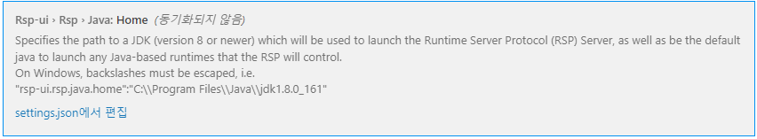
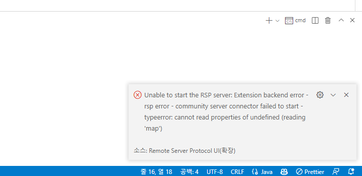

> Ihis Issue is resolved in the latest version of the extension: [link](https://github.com/redhat-developer/rsp-server-community/issues/152)  

> ❗ Translations provided by machine translation.  

## TL;DR
Sets the java home (rsp-ui.rsp.java.home) of the Remote Server Protocol UI extension.  
(Even if the existing java home is set, the extension's java home must be set.)  

## summary
A Connector Failed to Start error occurred while using the Remote Server Protocol UI, a VSCode extension.
The error message is:  
  

> Unable to start the RSP server: Extension backend error
> rsp error - community server connector failed to start
> typeerror: cannot read properties of undefined (reading 'map')  

There was no detailed error message, so I debugged it myself. When setting the Java path, if 'rsp-ui.rsp.java.home' is not set  
It was a problem caused by not escaping \ at this time when JAVA_HOME was imported from system environment variables or VSCode settings.  

Until the update, setting 'rsp-ui.rsp.java.home' can resolve this as a temporary solution.  

## action
1. Set 'rsp-ui.rsp.java.home' in VSCode settings. (Sets the JAVA_HOME path of each computer.)
2. Each folder escapes with `\\`.
