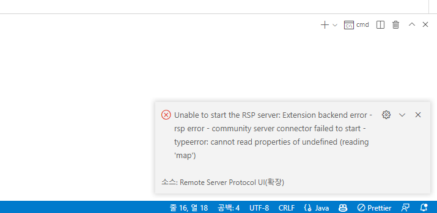
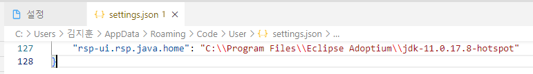

> 조치되었습니다. [링크](https://github.com/redhat-developer/rsp-server-community/issues/152)

## TL;DR
Remote Server Protocol UI 확장의 java home을(rsp-ui.rsp.java.home) 설정해준다.  
(기존 java home이 설정되어 있어도, 확장의 java home을 설정해줘야 함.)  

## 개요
VSCode 확장인 Remote Server Protocol UI를 사용하다가 Connector Failed to Start 에러가 발생했다.  
에러메세지는 다음과 같다.  
  

> Unable to start the RSP server: Extension backend error 
> rsp error - community server connector failed to start
> typeerror: cannot read properties of undefined (reading 'map')  

상세한 에러메세지가 없어, 직접 디버그 하였는데.  

Java 경로 설정시 'rsp-ui.rsp.java.home' 에서 설정하지 않는 경우  
시스템 환경변수 혹은 VSCode 설정에서 JAVA_HOME을 가져오는데,  
이때, \를 escape 해주지 않아서 발생하는 문제였다.

업데이트 전까지, 'rsp-ui.rsp.java.home'을 설정해주면 임시방편으로 해결할 수 있다.  

## 조치
1. VSCode 설정에서 'rsp-ui.rsp.java.home'을 설정해준다.(각 컴퓨터의 JAVA_HOME 경로를 설정해준다.)
2. 각 폴더는 `\\`로 escape 해준다.  
