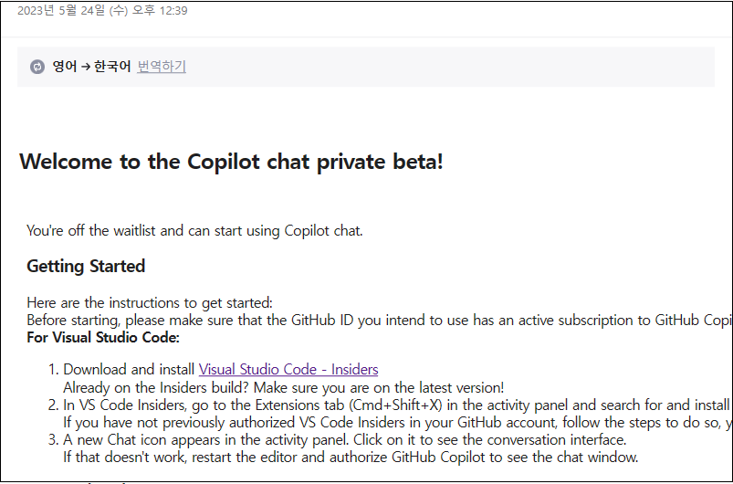
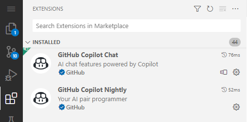
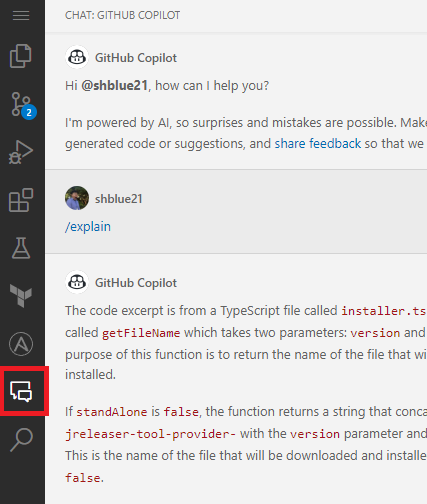
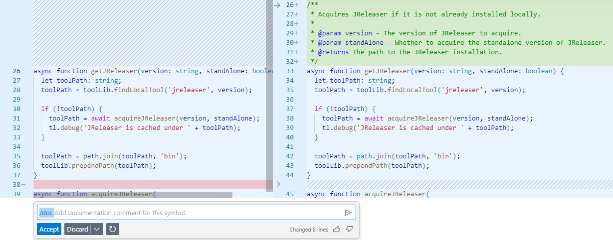

올해 2023년 3월 말에 Copilot X가 공개되었습니다.  
Copliot Chat, Copilot Docs, Copliot CLI등 여러 서비스로 나뉘어 공개되었는데,  
전부 Waitlist에 등록하고, 근 2달여만에 Pirvate Beta에 참여할 수 있었습니다.

1달정도 사용해보고, Coplilot Chat 후기를 작성합니다.

  
(초대 메일)

### Copilot이 무엇인가요?

Copilot은 Github에서 공개한 인공지능 기반의 코드 자동완성 도구입니다.  
OpenAI GPT-3모델의 후속작인 Codex를 사용하여, 코드를 생성해줍니다.  

VSCode, Visual Studio, IntelliJ 등의 IDE에서 사용할 수 있으며, 사용자가 작성하려는 코드의 일부를 입력하면 나머지 코드를 자동으로 생성해줍니다.  
이를 통해 개발자는 빠르고 정확하게 코드를 작성할 수 있습니다.

### Copilot Chat 사용 방법
Copilot Chat 사용하려면 Waitlist에 등록해야 하며, Copilot을 결제해서 사용중이어야 합니다.  

(등록하고 꽤 지난 후에 초대 메일이 왔습니다.)
Visual Studio 혹은 Visual Studio Code에서만 사용가능하며 VSCode는 Insider 버전을 사용해야 합니다.  
private beta에 참여하면 GitHub Copilot Nightly 확장을 설치하면 기능이 활성화됩니다.

  
Copilot Lab과 혼동하면 안됨.

### Copilot Chat 주요 특징  
#### 괜찮은 확장 경험
Copilot Chat은 사이드바에서 직접 프롬프팅하거나, Command Palette 혹은 에디터에서 우클릭 하여 사용할 수 있습니다.

  
사이드바에서 직접 프롬프팅  

  
에디터에서 직접 프롬프팅

TBD
#### 코드에 특화된 자연어 처리
TBD, Compare with ChatGPT

