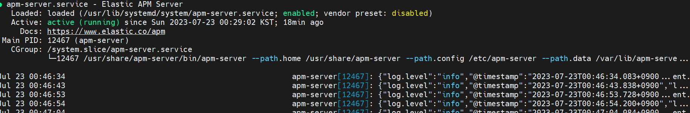
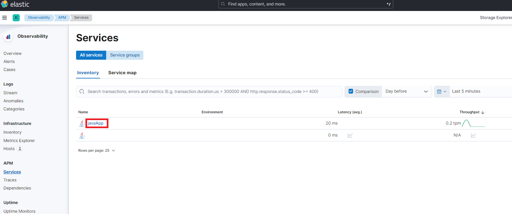
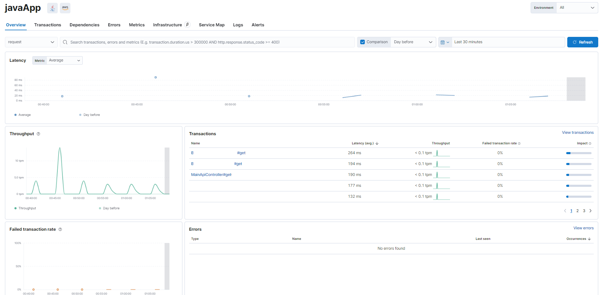
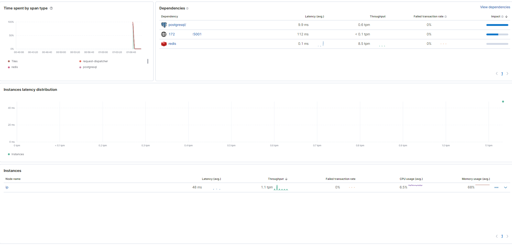
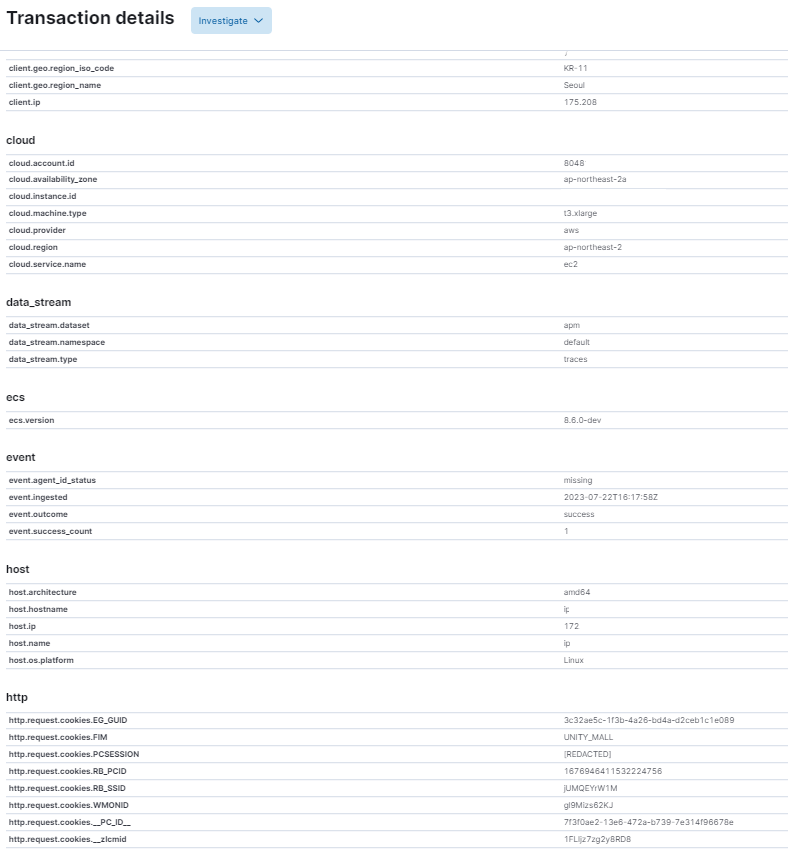

# Introduction
Elastic APM is a valuable tool for monitoring the performance of your applications. In this tutorial, we will walk you through the steps required to install and configure Elastic APM for a Java application.

## Table of Contents
- [Introduction](#introduction)
  - [Table of Contents](#table-of-contents)
  - [Installation Steps {#installation-steps}](#installation-steps-installation-steps)
    - [Step 1: Install Elastic APM](#step-1-install-elastic-apm)
    - [Step 2: Setting up the APM Server](#step-2-setting-up-the-apm-server)
    - [Step 3: Install APM Agent](#step-3-install-apm-agent)
    - [Step 4: Monitor your application](#step-4-monitor-your-application)
  - [Conclusion](#conclusion)

## Installation Steps {#installation-steps}

### Step 1: Install Elastic APM 
If you're using Elastic Cloud, you don't need to install an APM server.  
If you are using Managed Elastic Search, you will need to install `apm-server`. The official Elastic documentation provides a guide. [Guide](https://www.elastic.co/guide/en/apm/guide/current/installing.html)

``` bash
curl -L -O https://artifacts.elastic.co/downloads/apm-server/apm-server-8.8.2-x86_64.rpm
sudo rpm -vi apm-server-8.8.2-x86_64.rpm
```  
The commands above show how to install using rpm, and the official documentation shows how to install windows, deb, or unzip.  

If the elastic search and version do not match, you will receive an error message after configuration, so please match the elastic search and version (especially if the apm-server version is high).
Simply replace the version of the command above with.


### Step 2: Setting up the APM Server
The APM server is configured in the `/etc/apm-server/apm-server.yml` file.  

There are many settings inside, but you must set the Host, ElasticSearch address, and ID/PW to request from the APM-agent. (Set the same as the Elastic host settings)  
``` yml
apm-server: 
  host: "123.123.123.10:8200"
output.elasticsearch: 
  hosts: ["localhost:9200"] # Apm-server installed on the same server as ElasticSearch
  username: "elastic" ## if you set user for apm-server, you can set another user
  password: "changeme" 
```

Then you need to start the apm-server.  
``` bash
sudo systemctl start apm-server
sudo systemctl enable apm-server
sudo systemctl status apm-server
```


### Step 3: Install APM Agent
To send metrics to the Elastic APM-Server, you can add a Java-Agent directly, run a Jar that attaches it automatically, or embed it in your code.  
In this tutorial, we will use the Java-Agent method. It's the easiest way to get started.
If you want to use the other two methods, please refer to the official documentation.[Setup Agent](https://www.elastic.co/guide/en/apm/agent/java/current/setup.html)  

Download the agent jar file from the sonar maven repository.  
``` bash
curl -o 'elastic-apm-agent.jar' -L 'https://oss.sonatype.org/service/local/artifact/maven/redirect?r=releases&g=co.elastic.apm&a=elastic-apm-agent&v=LATEST'
```  
Then, add the following to the JVM options when running the application.  

``` bash
java -javaagent:/path/to/elastic-apm-agent.jar \
     -Delastic.apm.service_name=javaApp \
     -Delastic.apm.server_urls=http://123.123.123.10:8200 \
     -Delastic.apm.application_packages=org,com,java \ ## it's important for method profiling
     -jar my-application.jar
```

### Step 4: Monitor your application
If you've followed the steps above, you should be able to see the metrics in the APM dashboard.
Please go to the APM dashboard and check the metrics.  

  
(you can inventory name `javaApp` when you set `elastic.apm.service_name` in JVM options)

you can see the metrics of the application you are monitoring.
In the Transactions panel, you can see the name of the class and method on call. You can also see the latency.  


The Dependencies panel shows the relevant DB and HTTP calls.
The Instances pane also lets you see if you have the same service name set up on multiple servers, the latency per server, and more.  


When you select a transaction, which methods are executed on which line, and how long it takes to execute each method, you can see the details.


If you click trace, you can see the details of the transaction.  
Elastic APM provides a lot of data to Elastic Search, including GEO data, HTTP header information (cookies, sessions), and the request URL.  
It even tells you which cloud it's hosted on.


## Conclusion
I've used many monitoring tools, but If you use Elastic Search, I recommend using Elastic APM.  
You can use Kibana to monitor powerful APM metrics.  
Configuring APM-Server and setting up APM is very easy and fast.
However, there is a weakness in using the APM dashboard to see errors in real time.