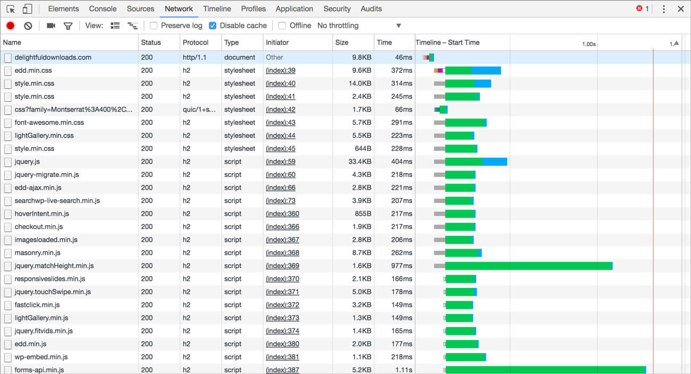

2023년 8월부터 퍼블릭 클라우드 제공자들은 HTTP/2 프로토콜의 취약점인 Rapid Reset을 악용한 대규모 분산 서비스 거부(DDoS) 공격을 보고했습니다.  

이전에 볼 수 없던 대규모 DDoS 공격인데요(Cloudflare 역대 공격의 **3배** 규모)  
국내에는 Rapid Reset에 대한 정보가 없어서 정리하였습니다.

## Rapid Reset 공격 발생 및 원인

### 공격의 배경과 실제 사례  
{: .align-center}
\[그림1\] 공격당시 GCP의 트래픽 그래프(약 4억 요청)
{: .text-center}

2023년 8월 Google, AWS, Azure, Cloudflare 등 주요 퍼블릭 클라우드 제공자들은 HTTP/2 프로토콜의 취약점인 HTTP/2 Rapid Reset을 악용한 대규모 분산 서비스 거부(DDoS) 공격을 보고했습니다.  

이 공격은 이전에 볼 수 없던 규모로 Amazon은 불과 이틀 동안 수십 건의 Rapid Reset 공격을 관찰하고 완화(Mitigation)했으며, 큰 공격은 초당 **1억 5천만 요청**(RPS)에 달했습니다.  

Cloudflare는 초당 **2억** 요청에 달하는 공격을 완화하였으며, Google은 초당 **3억 9천만** 요청에 달하는 퍼블릭 클라우드 중 가장 큰 공격을 완화했습니다.

이번 DDoS 공격에서 우려되는 점은, 일반적인 DDoS 공격은 수백만 대의 봇넷에서 발생하지만, 이번 공격은 비교적 작은 봇넷(약 2만 대)에서 발생했다는 점입니다.  

### Rapid Reset 공격 방법
Rapid Reset 취약점은 HTTP2 프로토콜의 취약점으로, **RST_STREAM** 패킷을 악용한 것입니다. [CVE 링크](https://www.cve.org/CVERecord?id=CVE-2023-44487)  
이를 제대로 이해하기 위해서는 HTTP/2 프로토콜의 특성 중 특히 스트림 멀티플렉싱(Multiplexing)에 대한 이해가 필요합니다.

#### Multiplexing  
{: .align-center}
\[그림2\] HTTP/2 Multiplexing
{: .text-center}
HTTP/1.1에서는 각 요청이 **순차적**으로 처리됩니다. 서버는 요청을 읽고 처리하고, 응답을 보낸 후, 다음 요청을 읽고 처리합니다. 이는 **단일** 연결을 통해 전송할 수 있는 요청의 속도가 왕복 1건이라는 것을 의미합니다. (이미지 참고)  

이러한 제약으로 인해 클라이언트와 서버에서 처리량을 높이기 위해 HTTP/1.1 파이프라이닝(pipelining)을 사용할 수 있지만,  
대부분의 브라우저에서 올바르게 구현하는 것이 어려워 파이프라이닝 설정은 비활성화되어 있습니다. [Stackoverflow 링크](https://stackoverflow.com/questions/30477476/why-is-pipelining-disabled-in-modern-browsers)

HTTP/2를 사용하면 클라이언트는 단일 TCP 연결로 여러 개의 스트림을 동시에 열 수 있으며, 각 스트림은 하나의 HTTP 요청에 해당합니다. 이론상으로는 서버가 최대 동시 스트림 수를 제어할 수 있지만, 실제로는 클라이언트가 요청당 100개의 스트림을 열 수 있으며 서버는 이러한 요청을 병렬로 처리합니다.

멀티플렉싱을 완벽히 이해하기 위해서는 HTTP/2의 프레임 구조에 대한 이해가 필요하지만, 우리는 개발자 도구를 통해 HTTP/2의 멀티플렉싱을 보고 있습니다.
[HTTP/2 프레임 구조 링크](https://web.dev/articles/performance-http2?hl=ko#streams_messages_and_frames)  

{: .align-center}
\[그림3\] HTTP/1.1 네트워크 타임라인
{: .text-center}
{: .align-center}
\[그림4\] HTTP/2 네트워크 타임라인
{: .text-center}

HTTP/1.1에서는 요청이 순차적으로 처리되지만, HTTP/2에서는 요청이 병렬로 처리됩니다.  
위 이미지에는 표시되어 있지 않지만, `Connection ID`를 통해 하나의 TCP 연결에 여러 개의 스트림이 열리는 것을 확인할 수 있습니다.  
(HTTP/1.1은 각 요청에 대해 새로운 TCP 연결을 열어야 하기 때문에 `Connection ID`가 모두 다름, HTTP/2는 하나의 TCP 연결에 여러 개의 스트림이 열리기 때문에 `Connection ID`가 모두 같음)

#### RST_STREAM
`RST_STREAM`은 HTTP/2의 프레임 중 하나로, 스트림을 종료하고 해당 스트림에 대한 모든 프레임을 무시하도록 수신자에게 알리는 프레임입니다.  

위에서 보듯 여러 개의 스트림중 하나의 스트림에 대해 `RST_STREAM`을 보내면 해당 스트림은 종료되고, 해당 스트림에 대한 모든 프레임은 무시됩니다.  
  
{: .align-center}
\[그림5\] RST_STREAM 에러코드
{: .text-center}  

`RST_STREAM` 프레임은 다음과 같은 상황에서 사용됩니다:
1. 스트림 취소: 클라이언트나 서버가 요청중인 스트림이 더 이상 필요로 하지 않을 때 이를 취소할 수 있습니다. 예를 들어, 사용자가 웹 페이지 로딩을 중단하거나, 서버가 클라이언트의 요청을 처리할 수 없는 경우에 해당합니다.
2. 오류 처리: 스트림 처리 중에 오류가 발생했을 때, 해당 스트림을 중단시키고자 할 때 사용됩니다. 예를 들어, 요청 데이터의 형식 오류나 처리 불가능한 요청 등이 있을 수 있습니다.

와닿지 않죠? 실제적인 사례는 여러 이미지가 있는 웹 페이지를 로딩하는 도중 사용자가 페이지를 벗어나면, 즉 `Viewport` 밖으로 벗어나면 해당 스트림을 종료합니다.(`RST_STREAM` 프레임을 전송합니다.)

이러한 `RST_STREAM`을 악용한 것이 `Rapid Reset` 공격입니다.

#### 공격 원리
{: .align-center}
\[그림6\] Rapid Reset 공격
{: .text-center}  

공격의 원리는 간단합니다. 
1. 공격자는 `HEADERS` 와 `DATA` 프레임을 전송하여 서버에 스트림을 열도록 유도합니다.  
2. 스트림이 열리면 공격자는 즉시 `RST_STREAM` 프레임을 전송하여 해당 스트림을 종료합니다.  
3. 이 과정을 반복하면 서버는 스트림을 열고 즉시 종료하게 되며, 이는 서버의 리소스(메모리, CPU 등)를 고갈시키게 됩니다.  
  
공격자는 이러한 과정을 빠르고 연속적으로 반복함으로써(요청, 취소, 요청, 취소), 서버의 리소스를 고갈시키고, 서버의 정상적인 서비스를 방해합니다. 

특히 `Rapid Reset`이 강력한 이유는, `RST_STREAM` 프레임을 전송하면서 요청은 취소되지만, HTTP/2 연결은 종료되지 않고,  
일반적인 요청과 달리, 공격자는 응답을 기다리지 않고 다음 요청을 보낼 수 있기 때문입니다. (상기 이미지)

<!-- ## PoC
### 공격 도구
WIP -->

## 대응 방법  
### 퍼블릭 클라우드  
Cloudflare, GCP, Azure, AWS에서 발행한 Rapid Reset 공격 대응 방안을 확인하였는데요.  
결국 엣지 로케이션의 용량을 증설하였으니, 클라우드 벤더사에서 제공하는 Apllication Load Balancer를 사용하거나  

Cloud Armor, AWS WAF, Azure WAF등의 웹 방화벽을 사용하여 DDoS를 L7 레벨에서 방어하라는 내용이 대부분입니다.

웹 방화벽 없이 LB만 사용하는 경우, 각 클라우드 공급자들이 실제로 어떻게 대응하고 있는지 공개된 자료는 많지 않습니다.  
Cloudflare는 참고할만한 내용이 있습니다.

#### Cloudflare
[Cloudflare 링크](https://blog.cloudflare.com/technical-breakdown-http2-rapid-reset-ddos-attack)
상기 링크의 `Actions from the Cloudflare side` 참고하면 됩니다.  

Cloudflare는 HTTP/2를 위해 Nginx를 사용하고 있습니다.  
이전에도 DoS취약점을 대응하면서 완화 조치를 개발하고 배포하였다고 합니다.  

마찬가지로 금번 Rapid Reset 공격에 대해서도 완화 조치를 개발하였다고 하고, 서버의 HTTP/2 프레임 처리를 개선하였다고 합니다.  
추가로 `IP Jail`을 이용하여 공격자의 IP를 차단하였다고 합니다.
* IP Jail: 악의적인 트래픽을 생성하는 IP를 차단하는 방식, 특정IP 주소를 "감옥"에 가둬서 트래픽을 차단하는 방식  

#### 요약
어플리케이션 앞단에 L7 로드밸런서나, WAF같은 웹 방화벽으로 DDoS 방어중이라면, Rapid Reset 공격에 **이미** 대응되어 있습니다.  
다만 DDoS 방어가 없는 환경이나 WEB서버가 앞단에 있는 아키텍쳐라면, 대응 방안이 필요합니다.

당장 클라우드 아키텍처를 변경할 수 없는 경우, 웹 서버 패치 혹은 설정을 변경하여 대응할 수 있습니다.  
웹서버별 대응 방안을 아래에 정리하였으니 참고하시기 바랍니다.  

### Web 서버  
**모든 웹 서버는 HTTP/2 Rapid Reset 취약점에 대해 영향을 받을수 있습니다.**  
L7 로드밸런서 뒷단에 웹 서버를 두고 리버스 프록시로 사용하는 경우가 대부분인데,
그렇지 않고 웹 서버가 최앞단에 위치하고 있는 경우 영향을 받습니다.  

웹 서버 종류별로 영향을 받지 않거나, 패치 혹은 설정을 변경하여 대응할 수 있습니다.  
웹 서버별 대응 방안을 아래애 정리하였으니 참고하시기 바랍니다.  

다만 하기 대응방안 대부분은 **DDoS 공격** 자체를 완화하는 것은 아닙니다.  
(`RST_STREAM` 으로 인한 취약점을 완화 할뿐, DDoS를 막으려면 별도의 방화벽이나 WEB서버에서 제공하는 DDoS 방어 기능을 사용해야 합니다.)

대부분의 내용은  [CVE 링크](https://www.cve.org/CVERecord?id=CVE-2023-44487)의 레퍼런스를 참고하였습니다.  

#### Apache
> Apache 2.4.58 버전 이상으로 업데이트 합니다.  

Apache는 Rapid Reset 취약점에 영향을 받지 않습니다. HTTP2 요청시 클라이언트의 요청에 따라 서버의 모든 리소스를 할당하지 않는 로직이 있습니다.

Apache는 HTTP2를 구현할 떄, 처음 6개의 요청만 처리하게 구현되어 있습니다.  
(6개인 이유는 HTTP1.1의 병렬 요청과 같은 숫자이며, HTTP1.1에서 2로 마이그레이션 하는 것을 고려)  

클라이언트의 요청에 정상적으로 응답하게 되면 처리가능 요청의 개수는 점차 증가합니다.(TCP의 Window Size와 비슷한 개념)  

이 떄 RST_STREAM을 통해 요청을 취소하면, 처리가능 요청의 개수가 증가하지 않아, 요청을 무한정 처리할 수 없게 됩니다.  

**다만** Rapid Reset으로 유발된 다른 취약점(CVE-2023-45802) 떄문에 업데이트 해야합니다.  
클라이언트가 요청을 취소하는 경우(RST_STREAM을 전송), 드물게 요청에 따른 메모리가 즉시 해제 되지 않는 버그가 있습니다.

mod_http2 모듈은 C언어로 작성된 `nghttp2` 라이브러리를 사용하는데요.  
nghttp2 **1.57** 이상 버전을 사용하여 컴파일하거나, Apache 2.4.58(nghttp 1.57 라이브러리 사용 버전) 이상 버전으로 업데이트하면 해결됩니다.  
또한 nghttp 1.57 버전은 CVE-2023-45802 취약점을 해결한 버전입니다. [nghttp2 링크](https://github.com/nghttp2/nghttp2/releases/tag/v1.57.0)

#### Nginx
> Nginx를 최신버전 1.25.3으로 업데이트 합니다.  

Nginx도 기본적으로 큰 영향을 받지 않으나, 1.25.3 버전에서 취약점을 해결하였습니다. (하나의 Event Loop에서 동시에 처리할 수 있는 요청의 개수를 제한하는 로직)  
다만 성능향상을 위해 하기 값을 조정 하였다면, 값을 기본으로 변경하는 것을 권장합니다.  

추가로 하기 속성들은 HTTP/2와 Rapid Reset 공격에 직접적인 Nginx 속성입니다.
참고하시기 바랍니다.

- `keepalive_requests` 기본값인 1000으로 유지.
- `http2_max_concurrent_streams` 기본값인 128개의 스트림으로 유지
- `limit_conn` 값으로 단일 클라이언트에서 처리할 수 있는 요청 수를 제한하는 지시문을 추가할 수 있습니다(ngx_http_limit_conn_module 모듈)
- `limit_req` 마찬가지로 단일 클라이언트로부터 주어진 시간 내에 처리할 요청 수에 제한을 적용합니다. (ngx_http_limit_req_module 모듈)

#### LiteSpeed
LightSpeed라는 웹서버가 생소하실 수 있는데요, 2023년 기준 4위의 웹서버입니다. (개인적으로 http3를 써보고 싶어서 nginx에서 LiteSpeed로 변경한 경험이 있습니다)
LightSpeed는 HTTP/2 Rapid Reset 취약점에 영향을 받지 않습니다.  
[LightSpeed 링크](https://blog.litespeedtech.com/2023/10/11/rapid-reset-http-2-vulnerablilty/)
문서에 따르면 LightSpeed는 스트림을 처리하기 위한 우선순위 큐를 사용하고, 이 큐는 한번에 최대 100개의 스트림을 처리할 수 있습니다.

#### HAProxy
HAProxy는 HTTP/2 Rapid Reset 취약점에 대해 영향을 받지 않습니다.  
2018년에 배포된 Haproxy 1.9 버전 이상을 사용하고 있다면 우려할 필요가 없습니다.  
[HAProxy 링크](https://www.haproxy.com/blog/haproxy-is-not-affected-by-the-http-2-rapid-reset-attack-cve-2023-44487)

HAProxy는 HTTP/2 스트림을 처리할 때, 스트림 개수 기반이 아닌 스트림으로 인해 할당된 **리소스** 양의 기반으로 처리되기 때문입니다.  
따라서 스트림으로 인해 리소스를 많이 할당하게 되면, 새로운 스트림 생성은 보류되어 HAProxy가 다운되지 않습니다.

### IIS
WIP

#### Tomcat
> Tomcat 8.5.94, 9.0.81, 10.1.14 버전 이상으로 업데이트 합니다.
톰캣도 HTTP2를 지원하고 있기 때문에, 만약 톰캣에서 HTTP2를 사용한다면 영향을 받습니다.(사용하는 경우가 드물긴 함)
상기 권장하는 버전 이상으로 업데이트 하면 됩니다.  

업데이트하기 어려운 경우, `maxConcurrentStreams` 값을 100 이하로 낮추어서 완화할 수 있으나, 버전 업데이트를 권장합니다.  
`<UpgradeProtocol className="org.apache.coyote.http2.Http2Protocol" maxConcurrentStreams="20" />`  

[참고 링크](https://tomcat.apache.org/tomcat-10.1-doc/config/http2.html)
[패치 Commit](https://github.com/apache/tomcat/commit/9cdfe25bad707f34b3e5da2994f3f1952a163c3e)

## 결론
그래서 HTTP2는 위험한게 아닌가? HTTP1.1을 사용해야 하는거 아닌가? 라는 의문이 드실 수 있습니다.  
해외 커뮤니티에서도 많은 의견이 오갑니다. 근간이 되는 프로토콜은 구현이 작아야 한다는 의견도 있고,(다만 HTTP2는 충분히 작다고 생각합니다.),  프로토콜의 개선은 웹에서 더 많은 광고를 보여주기 위한 것이라는 재밌는 의견도 있습니다.

## 참고 자료
- https://www.apachelounge.com/changelog-2.4.html
<!-- - https://news.ycombinator.com/item?id=37861589 -->
<!-- - https://community.centminmod.com/threads/nginx-1-25-3-release-for-http-2-rapid-reset-ddos-attack-vulnerability-cve-2023-44487.24186/ -->
<!-- https://blog.litespeedtech.com/2023/10/11/rapid-reset-http-2-vulnerablilty/ -->
<!-- https://news.ycombinator.com/item?id=37830987 -->