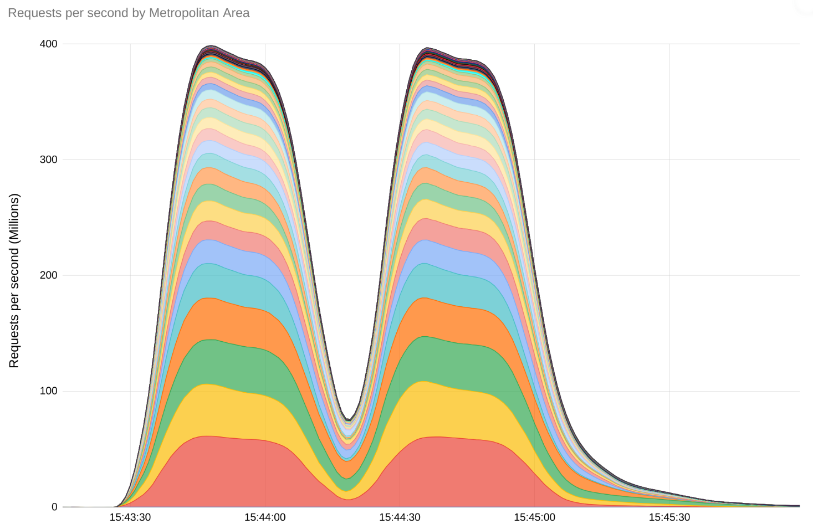
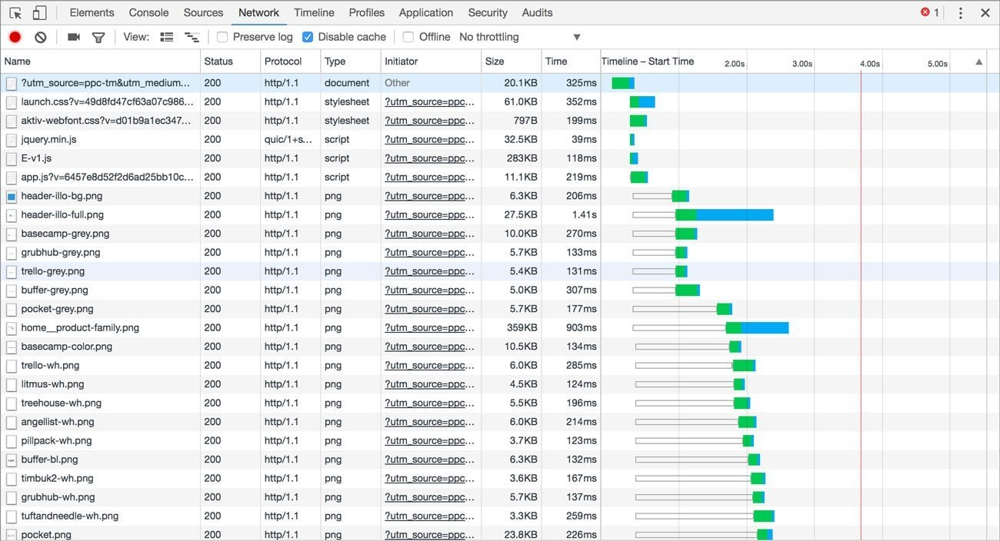
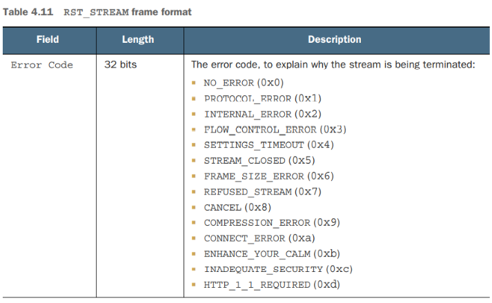
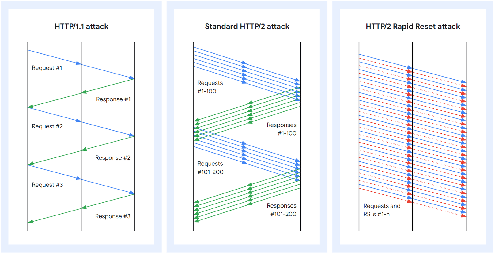

> ❗ Translations provided by machine translation.  

Since August 2023, public cloud providers have reported massive distributed denial-of-service (DDoS) attacks that exploit Rapid Reset, a vulnerability in the HTTP/2 protocol.  

This is an unprecedentedly large DDoS attack (**3x** the size of Cloudflare's previous attacks).  

There is no information about Rapid Reset in Korea, so we have summarized it for you.

## Rapid Reset Attack Occurrences and Causes

### How the attack happened and what it looks like 
{: .align-center}
\[Figure 1\] Traffic graph of GCP at the time of the attack (approximately 400 million requests)
{: .text-center}

In August 2023, major public cloud providers including Google, AWS, Azure, and Cloudflare reported a massive distributed denial of service (DDoS) attack that exploited HTTP/2 Rapid Reset, a vulnerability in the HTTP/2 protocol.  

The attacks were on a scale never seen before, with Amazon observing and mitigating dozens of Rapid Reset attacks in just two days, with the largest attack reaching **150 million requests per second** (RPS).  

Cloudflare mitigated an attack that reached **200 million requests per second**, and Google mitigated the largest attack of any public cloud at **390 million requests per second**.

What's concerning about this DDoS attack is that while a typical DDoS attack comes from a botnet of millions of machines, this attack came from a relatively small botnet (around 20,000 machines).  

### Rapid Reset Attack Techniques
The Rapid Reset vulnerability is a vulnerability in the HTTP2 protocol that exploits the **RST_STREAM** packet. [CVE Link](https://www.cve.org/CVERecord?id=CVE-2023-44487)  
To understand this properly, you need to understand the characteristics of the HTTP/2 protocol, specifically stream multiplexing.  

#### Multiplexing  
{: .align-center}
\[Figure 2\] HTTP/2 Multiplexing
{: .text-center}
In HTTP/1.1, each request is processed **sequentially**. The server reads and processes the request, sends a response, then reads and processes the next request. This means that the rate of requests that can be sent over a **single** connection is one round trip. (See image)  

Due to this limitation, although HTTP/1.1 pipelining can be used on the client and server to increase throughput,  
pipelining setting is disabled in most browsers due to the difficulty of implementing it correctly.  [Stackoverflow Link](https://stackoverflow.com/questions/30477476/why-is-pipelining-disabled-in-modern-browsers)

HTTP/2 allows clients to open multiple streams simultaneously over a single TCP connection, with each stream corresponding to a single HTTP request. In theory, the server can control the maximum number of concurrent streams, but in practice, clients can open 100 streams per request, and the server processes these requests in parallel.  

While a full understanding of multiplexing requires an understanding of HTTP/2's frame structure, we're looking at HTTP/2's multiplexing through the lens of developer tools.  
[HTTP/2 Frame Structure Link](https://web.dev/articles/performance-http2?hl=ko#streams_messages_and_frames)  

{: .align-center}
\[Figure 3\] HTTP/1.1 Network Timeline
{: .text-center}
{: .align-center}
\[Figure 4\] HTTP/2 Network Timeline
{: .text-center}

In HTTP/1.1, requests are processed sequentially, but in HTTP/2, requests are processed in parallel.  
Although not shown in the image above, you can see that multiple streams are opened on a single TCP connection via the `Connection ID`.  
(HTTP/1.1 has different `Connection ID`s because a new TCP connection must be opened for each request; HTTP/2 has the same `Connection ID`s because multiple streams are opened on one TCP connection)

#### RST_STREAM
`RST_STREAM` is one of the frames in HTTP/2 that tells the receiver to end the stream and ignore all frames for that stream.  

As shown above, sending `RST_STREAM` for one stream out of multiple streams will end that stream, and all frames for that stream will be ignored.
  
{: .align-center}
\[Figure 5\] RST_STREAM ErrorCode
{: .text-center}  

The `RST_STREAM` frame is used in the following situations:
1. stream cancellation: When a client or server no longer needs the stream it is requesting, it can cancel it. For example, when the user stops loading the web page, or when the server is unable to process the client's request.
2. Error handling: Used when an error occurs during the processing of a stream, and you want to abort that stream. For example, there might be a format error in the request data or an unprocessable request.

A practical example is when a web page with multiple images is loading and the user leaves the page, i.e. moves out of the `Viewport`, the stream is terminated (sending a `RST_STREAM` frame).

This exploitation of `RST_STREAM` is known as a `Rapid Reset` attack.

#### Attack Mechanism
{: .align-center}
\[Figure 6\] Rapid Reset Attack
{: .text-center}  

The principle of the attack is simple 
The attacker sends `HEADERS` and `DATA` frames to trick the server into opening the stream. 2.  
Once the stream is opened, the attacker immediately closes it by sending a `RST_STREAM` frame.  
3. By repeating this process, the server will open the stream and immediately close it, which will deplete the server's resources (memory, CPU, etc.).  
  
By repeating this process in rapid succession (request, cancel, request, cancel), the attacker depletes the server's resources and disrupts the server's normal service. 

What makes `Rapid Reset` particularly powerful is that the request is canceled by sending an `RST_STREAM` frame, but the HTTP/2 connection is not terminated,  
Unlike a normal request, the attacker can send the next request without waiting for a response. (Image above)

<!-- ## PoC
### 공격 도구
WIP -->

## Mitigation   
### Public Cloud
I checked out the Rapid Reset attack mitigation plans published by Cloudflare, GCP, Azure, and AWS.  
Now that we have increased the capacity of our edge locations, we can use application load balancers provided by our cloud vendors or use web firewalls such as Cloud Armor, AWS WAF, and Aura WAF to protect against DDoS at L7.  
Most of them recommend using a web firewall such as Cloud Armor, AWS WAF, Azure WAF, etc. to defend against DDoS at the L7 level.

If you're just using LB without a web firewall, there's not a lot of publicly available data on how each cloud provider is actually responding.  
Here's an article published by Cloudflare that you might find helpful.  

#### Cloudflare
[Cloudflare Link](https://blog.cloudflare.com/technical-breakdown-http2-rapid-reset-ddos-attack)
See `Actions from the Cloudflare side` in the link above.  

Cloudflare is using Nginx for HTTP/2.  
In the past, they have developed and deployed mitigations in response to DoS vulnerabilities.  

Similarly, for this Rapid Reset attack, they have developed mitigations and improved their server's HTTP/2 frame handling.  
In addition, the company said that it used IP Jail to block the attacker's IP.
* IP Jail: A method of blocking IPs that generate malicious traffic, where specific IP addresses are "jailed" to block traffic.

#### Summary
If your application is DDoS protected by an L7 load balancer or a web firewall such as a WAF, you are **already** protected against Rapid Reset attacks.  
However, if you don't have DDoS protection, or if your architecture has a web server at the front, you need to take action.

If you can't change your cloud architecture right away, you can patch or configure your web server.  
We have summarized the countermeasures for each web server below for your reference.

### Web Server  
**All web servers can be affected by the HTTP/2 Rapid Reset vulnerability.**
It is common to have a web server behind the L7 load balancer and use it as a reverse proxy,
Otherwise, if your web server is on the front end, it will be affected.  

Depending on the type of web server, you may not be affected, or you may be able to patch or configure your web server.  
Below, we have summarized the countermeasures for each web server.  

However, most of the following countermeasures do not mitigate the **DDoS attack** itself 
(It only mitigates the vulnerability caused by `RST_STREAM`, but to prevent DDoS, you need to use a separate firewall or DDoS protection provided by the WEB server)  

Most of the contents are referenced from the [CVE link](https://www.cve.org/CVERecord?id=CVE-2023-44487).

#### Apache
> Update to Apache version 2.4.58 or later. 

Apache is not affected by the Rapid Reset vulnerability. There is logic in HTTP2 requests that does not allocate all of the server's resources based on the client's request.

When Apache implemented HTTP2, it was implemented to only process the first six requests.  
(The reason it's six is because it's the same number as the parallel requests in HTTP1.1, and it takes into account the migration from HTTP1.1 to 2.)  

The number of requests that can be handled gradually increases as the client's requests are properly responded to (similar to TCP's window size).  

If you cancel the request via RST_STREAM, the number of available requests will not increase, and you will not be able to process requests indefinitely.

**However** it should be updated because of another vulnerability (CVE-2023-45802) triggered by Rapid Reset.  
There is a bug where if the client cancels a request (sends RST_STREAM), in rare cases, the requested memory is not immediately freed.

The mod_http2 module uses the `nghttp2` library, which is written in C.  
This is fixed by compiling using nghttp2 **1.57** or later, or by updating to Apache 2.4.58 (which uses the nghttp 1.57 library) or later.
In addition, nghttp 1.57 is the version that addresses the CVE-2023-45802 vulnerability. [nghttp2 link](https://github.com/nghttp2/nghttp2/releases/tag/v1.57.0)  

#### Nginx
> Update Nginx to the latest version 1.25.3.  

Nginx is also basically unaffected, but we fixed a vulnerability in version 1.25.3 (logic limiting the number of requests that can be processed simultaneously in one Event Loop).  
However, if you have adjusted the following values to improve performance, we recommend changing them to default.

In addition, the following properties are Nginx properties that directly affect HTTP/2 and Rapid Reset attacks.
Please note that  

- Keep `keepalive_requests` at its default value of 1000.  
- Keep `http2_max_concurrent_streams` at the default of 128 streams.
- You can add a directive with the value `limit_conn` to limit the number of requests that can be handled by a single client (ngx_http_limit_conn_module module).
- Similarly, `limit_req` applies a limit to the number of requests to be processed within a given time from a single client (ngx_http_limit_req_module module)

#### LiteSpeed
You may be familiar with LiteSpeed, which is the 4th fastest web server in the world as of 2023. (I personally switched from nginx to LiteSpeed because I wanted to try out http3 quickly).  
LightSpeed is not affected by the HTTP/2 Rapid Reset vulnerability.  
[LightSpeed Link](https://blog.litespeedtech.com/2023/10/11/rapid-reset-http-2-vulnerablilty/)
According to the documentation, LightSpeed uses a prioritized queue for processing streams, which can handle up to 100 streams at a time.  

#### HAProxy
HAProxy is not affected by the HTTP/2 Rapid Reset vulnerability.  
If you're using Haproxy version 1.9 or later, which was deployed in 2018, you shouldn't have any concerns.  
[HAProxy Link](https://www.haproxy.com/blog/haproxy-is-not-affected-by-the-http-2-rapid-reset-attack-cve-2023-44487)

This is because when HAProxy processes HTTP/2 streams, it does so based on the amount of resources allocated due to the streams, not based on the number of streams.  
So if a stream causes a lot of resources to be allocated, the creation of new streams is put on hold so that HAProxy doesn't go down.  

### IIS
WIP

#### Tomcat
> Update to Tomcat version 8.5.94, 9.0.81, 10.1.14, or later.
Tomcat is also affected because it supports HTTP2. Updating to the above version or higher will resolve this.  
If updating is difficult, you can mitigate by lowering the `maxConcurrentStreams` value to 100 or less, but we recommend updating the version.  
`<UpgradeProtocol className="org.apache.coyote.http2.Http2Protocol" maxConcurrentStreams="20" />`  

[MaxConcurrent](https://tomcat.apache.org/tomcat-10.1-doc/config/http2.html)
[Commit](https://github.com/apache/tomcat/commit/9cdfe25bad707f34b3e5da2994f3f1952a163c3e)

## Conclusion
So you might be asking yourself, isn't HTTP2 dangerous and shouldn't I be using HTTP1.1?  
There is a lot of debate in the international community. Some say that the underlying protocol should have a small implementation (but I think HTTP2 is small enough), while others have the hilarious opinion that improvements to the protocol are just to show more ads on the web.

## References
- https://www.apachelounge.com/changelog-2.4.html
<!-- - https://news.ycombinator.com/item?id=37861589 -->
<!-- - https://community.centminmod.com/threads/nginx-1-25-3-release-for-http-2-rapid-reset-ddos-attack-vulnerability-cve-2023-44487.24186/ -->
<!-- https://blog.litespeedtech.com/2023/10/11/rapid-reset-http-2-vulnerablilty/ -->
<!-- https://news.ycombinator.com/item?id=37830987 -->