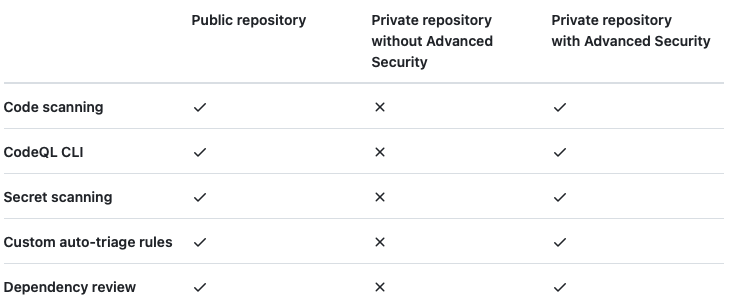
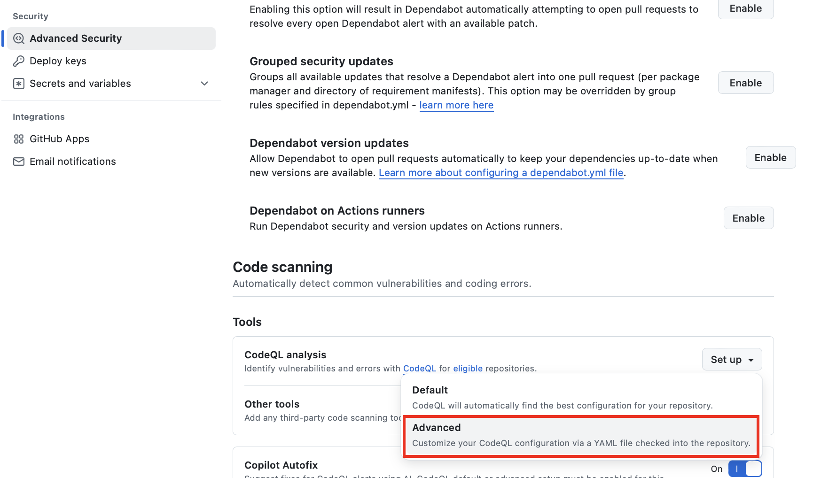

​This article presents a method for leveraging CodeQL to enhance both code quality and security in software development.  
In particular, it covers how to apply extended query packs such as community packs and extension packs beyond the default configuration.​  

## What Is CodeQL?  
{: .align-center}  
\[Figure 1\] At the time Semmle was acquired  

​CodeQL is a code analysis engine originally developed by Semmle, acquired by Microsoft in 2019, and is now integrated into GitHub as a security tool.  
CodeQL treats code as data and uses queries to analyze source code, identifying security vulnerabilities and bug patterns through semantic code analysis.  

{: .align-center}  
\[Figure 2\] GHAS usage conditions  

CodeQL can be used free of charge on public repositories.  
However, using CodeQL on private repositories requires a GitHub Advanced Security license.

## Default Query Packs  

Default query packs are the standard set of queries provided by CodeQL out of the box, focusing on identifying commonly known security vulnerabilities and code quality issues. These queries are predefined for various programming languages, allowing developers to use them immediately without any additional setup. Default query packs include the following categories:​

- **Security Vulnerability Detection:** Identifies common security vulnerabilities such as SQL injection and Cross-Site Scripting (XSS).  
- **Code Quality Issue Detection:** Detects issues that can affect code quality, such as unused variables, duplicated code, and inefficient logic.​  
 
Default query packs are free to use on public repositories and can also be utilized in private repositories covered by a GitHub Advanced Security license.

## Extending Query Packs  
{: .align-center}  
\[Figure 3\] CodeQL Advanced settings  

While CodeQL’s built-in query packs alone can detect most security and quality issues, additional inspection logic may be required depending on your organization’s characteristics or project requirements.  

In such cases, you can expand CodeQL’s analysis scope and depth by leveraging community packs or extension packs.  
In the repository’s “Advanced Security” settings, select “CodeQL analysis,” then click “Advanced” to modify the CodeQL YAML file and apply additional query packs.

### GitHub Security Community Packs  
CodeQL community packs are additional resource collections provided by the GitHub Security Lab and the open-source community to supplement the built-in query packs. These community packs include deep models and queries for languages and frameworks that the built-in set cannot cover. There are three main types of community packs:  

- **Model Packs:**  
  Provide additional taint-tracking source and sink models and summaries. They model security flows for libraries and frameworks not supported by the default query packs, enabling more precise taint-flow analysis.  

- **Query Packs:**  
  Include additional security vulnerability detection and code quality improvement queries. They help discover potential issues—such as OWASP Top 10 vulnerabilities, authentication/authorization checks, and injection patterns—that the default packs might miss.  

- **Library Packs:**  
  Do not contain queries themselves but provide common functions and utility libraries required by query packs. They modularize reusable functions and common utility code so that various query packs can use them consistently.  

By combining these three types of community packs, you can proactively detect **security flaws in specific libraries/frameworks** and **domain-specific code quality issues** that built-in query packs might miss.

### Example YAML Configuration  
You can apply community packs by modifying the YAML file in the “Advanced” settings. Here is an example configuration:  

```yaml
name: "CodeQL Analysis"
on:
  push:
    branches:
      - main # Branch to scan
jobs:
  code-scan:
    name: CodeQL Community Pack Scan
    runs-on: ubuntu-latest

    strategy:
      fail-fast: false

    steps:
      - name: Checkout
        uses: actions/checkout@v4

      - name: Initialize CodeQL
        uses: github/codeql-action/init@v3
        with:
          languages: java
          queries: java
          packs: githubsecuritylab/codeql-java-queries # Apply the “Query Packs” community pack
          # , githubsecuritylab/codeql-java-extensions # Also apply the “Model Packs” community pack
          
      - name: Autobuild
        uses: github/codeql-action/autobuild@v3

      - name: Analyze with CodeQL
        uses: github/codeql-action/analyze@v3
```  

### Detection Results
As with the default packs, you can view analysis results under the repository’s “Security” tab.
Rules with IDs starting with “githubsecuritylab” are provided by the community packs.
{: .align-center}

## References

https://github.blog/security/vulnerability-research/announcing-codeql-community-packs/?utm_source=chatgpt.com
