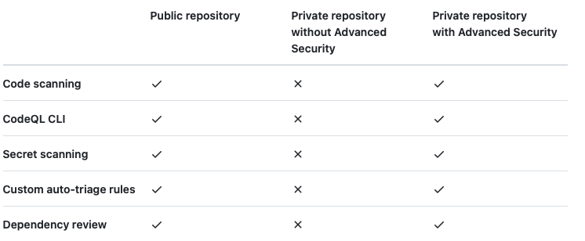
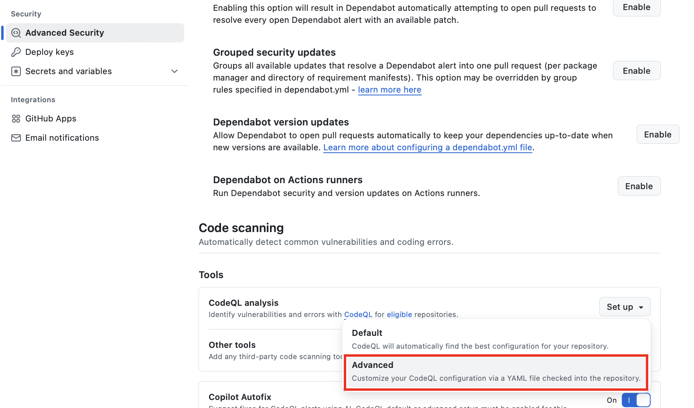

​소프트웨어 개발에서 코드의 품질과 보안을 동시에 향상시키기 위해 CodeQL을 활용하는 방법을 소개합니다.  
특히, 기본 설정을 넘어 커뮤니티 팩과 익스텐션 팩과 같은 확장된 룰셋을 적용하는 방법을 다룹니다.​  

## CodeQL이란?  
{: .align-center}
\[그림 1\] Semmle 인수 당시  

​CodeQL은 Semmle서 개발한 코드 분석 엔진으로, 2019년 MS에 인수되어 현재는 GitHub의 보안 도구로 통합되어 사용되고 있습니다.  
CodeQL은 코드를 데이터처럼 취급하여 쿼리를 통해 소스 코드를 분석하고, 보안 취약점과 버그 패턴을 식별하는 의미론적 코드 분석(Semantic Code Analysis) 엔진입니다.  

{: .align-center}
\[그림 2\] GHAS 사용 조건  

GitHub의 퍼블릭 리포지토리에서는 CodeQL을 무료로 사용할 수 있습니다.  
그러나 프라이빗 리포지토리에서 CodeQL을 사용하려면 GitHub Advanced Security 라이선스가 필요합니다

## 기본 쿼리 팩(Query Pack) vs 확장 쿼리 팩
​CodeQL은 소스 코드를 분석하여 보안 취약점과 코드 품질 문제를 식별하는 강력한 정적 분석 도구입니다.  
분석은 CodeQL에서 제공하는 다양한 쿼리 팩(Query Packs)을 통해 수행되며, 선택한 쿼리 팩에 따라 분석의 범위와 깊이가 달라집니다.  

기본 쿼리 팩과 확장된 쿼리 팩의 차이점을 살펴보겠습니다.​

### 기본 쿼리 팩

기본 쿼리 팩은 CodeQL이 기본적으로 제공하는 표준 쿼리 모음으로, 일반적으로 알려진 보안 취약점과 코드 품질 문제를 식별하는 데 중점을 둡니다. 이러한 쿼리는 다양한 언어에 대해 사전 정의되어 있으며, 개발자가 특별한 설정 없이도 즉시 활용할 수 있습니다. 기본 쿼리 팩은 다음과 같은 범주를 포함합니다:​

- 보안 취약점 탐지: SQL 인젝션, 크로스 사이트 스크립팅(XSS) 등과 같은 일반적인 보안 취약점을 식별합니다.​
- 코드 품질 문제 탐지: 사용되지 않는 변수, 중복 코드, 비효율적인 로직 등 코드 품질에 영향을 미칠 수 있는 문제를 발견합니다.​  
 
기본 쿼리 팩은 퍼블릭 리포지토리에서 무료로 사용할 수 있으며, GitHub Advanced Security 라이선스가 있는 프라이빗 리포지토리에서도 활용할 수 있습니다.

## 확장 룰셋 적용하기  
{: .align-center}
\[그림 3\] CodeQL Advanced 설정  

CodeQL에서 기본 제공 쿼리 팩(Query Pack)만 사용해도 대부분의 보안 및 품질 문제를 탐지할 수 있지만, 조직의 특성이나 프로젝트 요구사항에 따라 추가 검사 로직이 필요할 수 있습니다.  

이때 커뮤니티 팩 또는 익스텐션 팩을 활용하면 CodeQL 분석 범위와 깊이를 확장할 수 있습니다.  
저장소 설정의 Advanced Security 섹션에서 CodeQL analysis를 선택한 후, "Advanced" 를 클릭하여 CodeQL YAML 파일을 수정하여 추가 룰셋을 적용할 수 있습니다.

### Github Security 커뮤니티 팩 구성
CodeQL 커뮤니티 팩은 **기본 쿼리 팩(Query Pack)**을 보완하기 위해 GitHub Security Lab과 오픈소스 커뮤니티가 제공하는 추가 리소스 모음입니다. 이들 커뮤니티 팩은 기본 세트만으로는 다루기 어려운 언어별·프레임워크별 심층 모델과 쿼리를 포함하여 분석 범위를 확장해 줍니다. 커뮤니티 팩에는 크게 세 가지 유형이 있습니다  

- **Model Packs**:  
  Taint Tracking(오염 흐름) 소스·싱크 모델과 요약(summary)을 추가로 제공합니다. 기본 쿼리 팩이 지원하지 않는 라이브러리나 프레임워크의 보안 흐름을 모델링하여, 보다 정교한 오염 경로 분석이 가능합니다.  

- **Query Packs**:  
  보안 취약점 탐지 및 코드 품질 개선을 위한 추가 쿼리 집합을 포함합니다. OWASP Top 10, 인증·권한 검사, 인젝션 패턴 등 기본 팩에서 놓칠 수 있는 잠재적 이슈를 찾아냅니다.  

- **Library Packs**:  
  자체적으로 쿼리를 포함하지는 않지만, Query Pack이 필요로 하는 공통 함수와 도움말 라이브러리를 제공합니다. 재사용 가능한 함수, 공통 유틸리티 코드 등을 모듈화하여 다양한 쿼리 팩이 일관된 방식으로 활용할 수 있게 돕습니다.  

위 세 가지 커뮤니티 팩을 결합하면, 기본 제공 쿼리 팩에서 탐지하지 못했던 **특정 라이브러리/프레임워크의 보안 결함**이나 **도메인 특화 코드 품질 문제**를 사전에 발견할 수 있습니다.

### YAML 파일 구성 예제

### 탐지 결과

## 요약 및 마무리  

## 참고 자료
- https://github.blog/security/vulnerability-research/announcing-codeql-community-packs/?utm_source=chatgpt.com