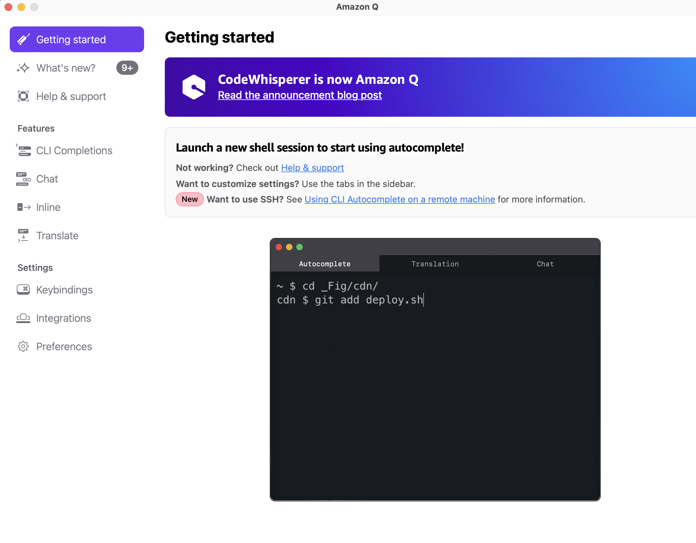
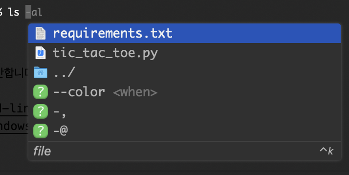

> 이 글은 터미널에서 동작하는 AI 에이전트 Amazon Q CLI를 이용해, 단순한 프롬프트만으로 파이썬 Pygame 틱택토 게임을 완성한 과정을 기록한 후기입니다.  

## AI 에이전트란?
**AI 에이전트(AI Agent)**는 LLM을 중심으로 “관찰 → 계획 → 행동” 루프를 돌며, 외부 도구 호출·파일 시스템 접근·API 연동 등을 스스로 수행해 사용자의 목표를 달성하도록 설계된 자율(autonomous) 시스템입니다.  

일반 **LLM 챗봇**이 “질문 → 텍스트 응답”에 머무르는 **지식 엔진**이라면, **AI 에이전트**는 그 지식을 실제 행동으로 옮겨 시스템을 변화시키는 **실행 엔진**입니다.  

다시 말해, LLM이 ‘두뇌’ 역할을 한다면 에이전트는 여기에 ‘손과 발(도구 사용 능력과 자율 루프)’을 붙여 더 큰 목표를 스스로 완수하도록 만든 형태라 볼 수 있습니다.

> **예제: LLM과 AI 에이전트 차이**  
> - **LLM 챗봇**: “서울 날씨 알려줘” → “오늘 서울은 맑고 최고 25 °C입니다.”  
> - **AI 에이전트**: “서울 날씨를 실시간으로 보여주는 간단한 웹 앱을 만들어 줘.”  
>   1. **관찰**: 현재 디렉터리 확인, 필요한 라이브러리 존재 여부 확인  
>   2. **계획**: `weather.py` 스크립트 작성 → OpenWeather API 호출 → Flask 서버 구성 → HTML 템플릿 생성 → 실행 스크립트 작성  
>   3. **행동**: `pip install flask requests` 실행, 코드 파일 생성, 로컬 서버 기동  
>   4. **피드백**: 브라우저에서 페이지 열어 날씨 데이터 정상 노출 확인 → CSS 수정으로 UI 다듬기  

사용자는 한 문장만 입력했지만, 에이전트가 **코딩-빌드-실행** 전 과정을 완료해 즉시 사용 가능한 앱을 개발할 수 있습니다.

---
### Observe-Plan-Act (OPA) Cycle  
AI 에이전트가 **“텍스트 답변”** 수준을 넘어 실제 코드를 고치고 시스템을 배포하려면, **지금 해야 할 일**을 스스로 판단하고 결과를 바탕으로 행동을 계속 조정해야 합니다.  
이 메커니즘이 바로 **Observe-Plan-Act(OPA) 사이클**입니다.

#### OPA가 왜 중요한가?
1. **관찰(Observe) 없이는 맹목적 실행**  
    – 잘못된 파일을 수정하거나 이미 해결된 문제를 다시 건드릴 수 있습니다.  
2. **계획(Plan) 없는 행동은 비효율**  
    – 최적 경로(예: _“UI → 로직 → 테스트”_)를 잡지 못하면 시행착오가 늘어납니다.  
3. **피드백이 없으면 품질 보장이 불가**  
    – 결과를 점검하고 오류를 즉시 바로잡는 **자율 루프**가 필수입니다.  
4. **OPA 덕분에 다단계 워크플로우 자동화**  
    – _“코드 수정 → 빌드 → 테스트 → 배포”_ 같은 긴 파이프라인도 한 줄 프롬프트로 완주할 수 있습니다.

#### 단계별 흐름
1. **Observe (관찰)**  
    - 입력 프롬프트, 실행 결과, 코드·로그 등 **현재 상태**를 수집  
2. **Plan (계획)**  
    - 목표(예: _“틱택토 AI 상대 추가”_)에 도달할 **행동 시퀀스**를 작성  
3. **Act (행동)**  
    - 셸 명령 실행, API 호출, 코드 생성·수정 등 **외부 도구와 상호작용**  
4. **Feedback (피드백)**  
    - 행동 결과를 다시 관찰해 계획을 갱신 → **루프 반복**

---

### AI Agent 대표 도구
- **Amazon Q CLI**: 개발용 터미널 AI 에이전트 
- **GitHub Copilot Agent 모드**: PR 생성·리팩터링 자동화  
- **OpenAI Codex**: 소프트웨어 엔지니어링 에이전트

## Q CLI 설치 및 사용방법
{: .align-center}
**Amazon Q CLI**는 터미널에서 실행되는 AI 에이전트 입니다.  
대화형 프롬프트를 통해 코드 생성·리팩터링·테스트·배포 같은 개발 업무를 자동화하며,  수백 가지 CLI(예: `git`, `docker`, `aws`) 명령을 이해하고 실행 계획까지 제안합니다.  

설치방법은 공식 가이드의 인스톨러를 사용하면 쉽게 설치할 수 있으며  [설치 가이드 링크](https://docs.aws.amazon.com/amazonq/latest/qdeveloper-ug/command-line-installing.html)  
윈도우에서는 WSL환경에서 사용가능합니다.  [윈도우 설치 가이드](https://dev.to/aws/the-essential-guide-to-installing-amazon-q-developer-cli-on-windows-lmh)  

WSL에서 터미널 형식으로 사용해야 하므로 윈도우 환경에서는 사용이 불편합니다.  

{: .align-center}  

맥환경에서는 Shell Integration을 하면 터미널 자동완성등 유용한 기능을 사용할 수 있습니다.
