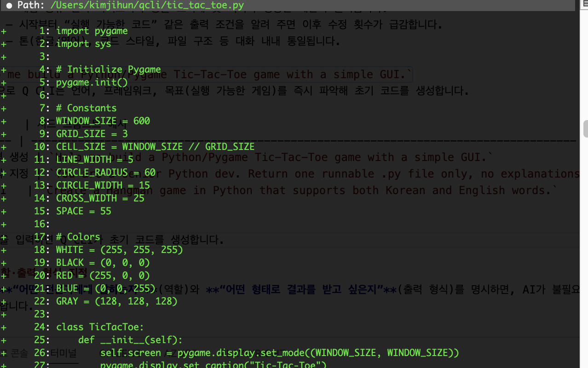
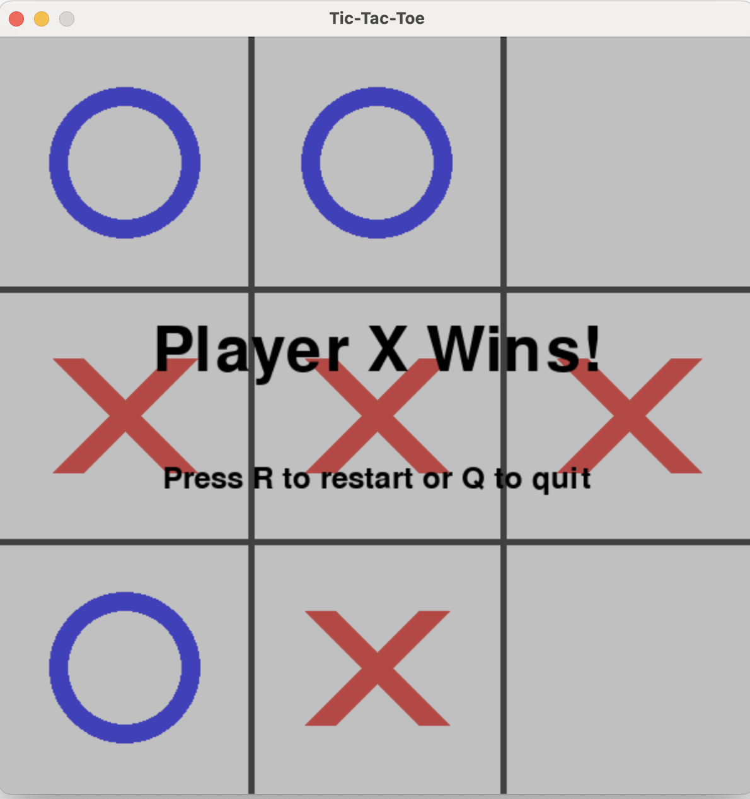

## 선택한 게임과 선택 이유

| 항목 | 설명 |
|------|------|
| 게임 | Tic-Tac-Toe (틱택토) |
| 플랫폼 / 라이브러리 | Python 3 + Pygame |
| 선택 배경 | - 규칙이 단순해 곧바로 개발·실험 가능<br>- 3×3 그리드, 마우스 이벤트, 승패 판정 등 게임 기본 요소를 모두 포함해 Q CLI의 코드 생성·리팩터링 능력을 확인하기 좋음<br>- 코드가 작아 `/context add` 기능으로 전체 파일을 대화에 넣고 수정하기 수월 |
| 학습·확장 가능성 | - 프롬프트만으로 AI 난이도(랜덤 → 미니맥스) 단계적 추가<br>- UI, 애니메이션, 사운드 등 Pygame 기능을 실험하며 점진적 확장 가능 |
| 블로그·영상 친화도 | - 화면 한 컷 GIF로도 이해 가능<br>- 단일 파일(약 300줄)이라 GitHub·블로그 삽입 부담이 적음 |
| Q CLI 데모 효과 | - “그리드 그려 줘 → X·O 추가해 줘 → 다시 시작 버튼 달아 줘” 같은 단계적 프롬프트로 OPA 루프와 실시간 피드백을 보여주기 좋음 |

> 틱택토는 **간단하지만 확장성 있는** 대표 예제로, AI 에이전트의 기능을 체감하기에 적합했습니다.


## 효과적인 프롬프트 기법
프롬프트를 ‘짧고 구체적으로’ 작성하면 Q CLI가 목표를 더 정확히 이해하고, 불필요한 수정 사이클을 크게 줄일 수 있습니다.  
특히 **역할 지정 → 출력 형식 명시 → 단계별 요청**의 세 가지 원칙만 지켜도, 초기 코드 생성부터 리팩터링·테스트 자동화까지 거의 모든 작업을 자연어 대화만으로 해결할 수 있습니다

### 1. 시드 프롬프트  
{: .align-center}{: width="80%"}  

**시드 프롬프트(Seed Prompt)**란 대화 세션의 방향과 범위를 한 번에 정해 주는 “첫 문장” 또는 **“초기 지시문”**을 말합니다.  

**씨앗(seed)**처럼 대화 맥락을 ‘발아’시켜 이후 모든 응답·추가 프롬프트가 이 기반 위에서 자라난다는 의미에서 붙은 이름입니다.  

Q CLI나 ChatGPT 같은 LLM 기반 도구는 첫 지시를 바탕으로 작업 목표, 출력 형식, 톤 등을 내부 컨텍스트에 저장해 계속 반영합니다.  

#### 왜 중요한가?
- 목표 명확화 – 게임 종류·언어·라이브러리 등을 초기에 못 박아야 엉뚱한 제안이 줄어듭니다.
- 반복 최소화 – 시작부터 “실행 가능한 코드” 같은 출력 조건을 알려 주면 이후 수정 횟수가 급감합니다.
- 일관성 유지 – 톤(한글/영어), 코드 스타일, 파일 구조 등 대화 내내 통일됩니다.  


예) `Help me build a Python/Pygame Tic-Tac-Toe game with a simple GUI.`  
이 한 줄만으로 Q CLI는 언어, 프레임워크, 목표(실행 가능한 게임)를 즉시 파악해 초기 코드를 생성합니다.  

| 목적       | 시드 프롬프트 예시                                                                         |
| -------- | ---------------------------------------------------------------------------------- |
| 기본 골격 생성 | `Help me build a Python/Pygame Tic-Tac-Toe game with a simple GUI.`                |
| 출력 형식 지정 | `You are a senior Python dev. Return one runnable .py file only, no explanations.` |
| 다국어 UI   | `Create a tic-tac-toe game in Python that supports both Korean and English words.`     |  

{: .align-center}{: width="80%"}  

첫 프롬프팅을 입력하면 Q CLI가 초기 코드를 로컬에 생성합니다.

### 2. 역할·출력 형식 지정
프롬프트에 **“어떤 전문가에게 말하는지”**(역할)와 **“어떤 형태로 결과를 받고 싶은지”**(출력 형식)를 명시하면, AI가 불필요한 설명 없이 원하는 스타일로 정확히 응답합니다.

```text
You are a Python game developer.
Return a single runnable .py file wrapped in triple backticks.
```  

### 3. 단계별(Chain) 요청  
{: .align-center}{: width="80%" height="80%"}  

한 번에 “모든 기능을 넣어 달라”고 요구하면 코드가 길어지고 오류가 생길 확률이 높습니다.  
대신 **UI → 게임 로직 → UX → 마무리**처럼 작업을 작게 쪼개 차례대로 프롬프트하면, 각 단계의 결과를 확인하며 안정적으로 완성해 나갈 수 있습니다.

| 단계 | 예시 프롬프트 | 기대 결과 |
|------|--------------|-----------|
| ① UI | `Add a 3×3 grid and draw X/O pieces when I click.` | 그리드와 클릭 이벤트 처리, `draw_grid`·`draw_figures` 함수 추가 |
| ② 로직 | `Implement winner detection for rows, columns, and diagonals.` | `check_winner` 함수 구현 |
| ③ UX | `Show "Current Player" text at the top left of the window.` | 현재 플레이어 표시 텍스트 렌더링 |
| ④ 마무리 | `Add a game-over overlay with restart (R) and quit (Q) options.` | 반투명 오버레이 + 키 이벤트 처리 |

**장점**  
1. 작은 단위로 테스트하니 버그 위치를 바로 파악할 수 있음  
2. 대화 컨텍스트가 복잡해지지 않아 AI가 의도를 잘못 이해할 가능성이 줄어듦  
3. 필요 없는 기능을 빼거나 우선순위를 바꾸기 쉬움  

1편에서 안내한 Observe-Plan-Act (OPA) Cycle처럼, 각 단계가 끝날 때마다 결과를 확인하고 다음 계획을 세우는 방식을 따릅니다.  


## AI가 해결한 고전 프로그래밍 과제

| 과제 | 수동 구현 시 번거로운 점 | Q CLI 해결 방식 |
|------|-------------------------|-----------------|
| 이벤트 루프 구성 | Pygame 초기화, `while` 루프, FPS 제한 직접 코딩 | 시드 프롬프트 한 줄에 기본 루프 자동 포함 |
| 승패 판정 로직 | 8가지 패턴을 일일이 if문으로 검사 | 3×3 배열 순회 + 리스트 컴프리헨션 코드 제시 |
| 좌표 → 셀 매핑 | 마우스 픽셀 좌표를 그리드 인덱스로 변환 | `get_cell_from_mouse()` 함수 생성 |
| 게임 오버 화면 | 반투명 오버레이, 텍스트 렌더링, 키 이벤트 처리 | “게임 오버 UI 추가” 프롬프트로 즉시 구현 |
| 코드 리팩터링 | 함수 길이·중복 코드 수작업 분리 | “리팩터링해 줘” 요청 → 함수 분할, 변수명 개선 |
| 의존성 관리 | `pip install pygame` 문서화 필요 | 설치 여부 감지 후 자동 설치 스니펫 제안 |

> 핵심: **AI 에이전트가 반복·보일러플레이트 작업을 대신** 처리해 주니, 개발자는 게임 아이디어와 UX 개선에 더 집중할 수 있었습니다.

## 개발 자동화로 절약한 시간

| 작업 단계 | 수동으로 걸리던 시간 | Q CLI 사용 시 | 절감 효과 |
|-----------|--------------------|--------------|-----------|
| 초기 골격 작성<br>(윈도우 생성·그리드·루프) | 약 20 분 | 시드 프롬프트 1줄 → 30 초 | **-19 분** |
| 의존성 설치<br>(pygame) | 문서 검색·설치 안내 작성 5 분 | “If pygame is missing, install it” 자동 스니펫 | **-5 분** |
| 승패 판정 로직 구현 | 10 분 | “Implement winner detection” 20 초 | **-9 분** |
| 게임 오버 UI 제작 | 15 분 | “Add a semi-transparent overlay…” 40 초 | **-14 분** |
| 코드 리팩터링·포매팅 | 10 분 | “Run black”·함수 분할 자동 수행 | **-10 분** |
| 테스트 코드 작성 | 15 분 | “Write pytest cases…” 30 초 | **-14 분** |

> 한 줄 프롬프트와 OPA 루프 덕분에 **총 1시간 이상**의 반복 작업을 아낄 수 있었습니다.

## AI 생성 코드 예제
```python
import pygame
import sys

# Initialize Pygame
pygame.init()

# Constants
WINDOW_SIZE = 600
GRID_SIZE = 3
CELL_SIZE = WINDOW_SIZE // GRID_SIZE
LINE_WIDTH = 5
CIRCLE_RADIUS = 60
CIRCLE_WIDTH = 15
CROSS_WIDTH = 25
SPACE = 55

# Colors
WHITE = (255, 255, 255)
BLACK = (0, 0, 0)
RED = (255, 0, 0)
BLUE = (0, 0, 255)

class TicTacToe:
    def __init__(self):
        self.screen = pygame.display.set_mode((WINDOW_SIZE, WINDOW_SIZE))
        pygame.display.set_caption("Tic-Tac-Toe")
        self.clock = pygame.time.Clock()
        
        # Game state - 3x3 grid
        self.board = [['' for _ in range(GRID_SIZE)] for _ in range(GRID_SIZE)]
        self.current_player = 'X'
        self.winner = None
        self.game_over = False
        
        # Font for winner display and current player
        self.font = pygame.font.Font(None, 74)
        self.small_font = pygame.font.Font(None, 36)
        
    def draw_grid(self):
        """Draw the 3x3 tic-tac-toe grid"""
        self.screen.fill(WHITE)
        
        # Draw vertical lines
        for i in range(1, GRID_SIZE):
            pygame.draw.line(
                self.screen, 
                BLACK, 
                (i * CELL_SIZE, 0), 
                (i * CELL_SIZE, WINDOW_SIZE), 
                LINE_WIDTH
            )
        
        # Draw horizontal lines
        for i in range(1, GRID_SIZE):
            pygame.draw.line(
                self.screen, 
                BLACK, 
                (0, i * CELL_SIZE), 
                (WINDOW_SIZE, i * CELL_SIZE), 
                LINE_WIDTH
            )
    
    def draw_pieces(self):
        """Draw X's and O's on the board"""
        for row in range(GRID_SIZE):
            for col in range(GRID_SIZE):
                if self.board[row][col] == 'X':
                    self.draw_x(row, col)
                elif self.board[row][col] == 'O':
                    self.draw_o(row, col)
    
    def draw_x(self, row, col):
        """Draw an X piece in the specified cell"""
        # Calculate cell center and draw diagonal lines
        start_desc = (col * CELL_SIZE + SPACE, row * CELL_SIZE + SPACE)
        end_desc = (col * CELL_SIZE + CELL_SIZE - SPACE, row * CELL_SIZE + CELL_SIZE - SPACE)
        pygame.draw.line(self.screen, RED, start_desc, end_desc, CROSS_WIDTH)
        
        start_asc = (col * CELL_SIZE + SPACE, row * CELL_SIZE + CELL_SIZE - SPACE)
        end_asc = (col * CELL_SIZE + CELL_SIZE - SPACE, row * CELL_SIZE + SPACE)
        pygame.draw.line(self.screen, RED, start_asc, end_asc, CROSS_WIDTH)
    
    def draw_o(self, row, col):
        """Draw an O piece in the specified cell"""
        center = (col * CELL_SIZE + CELL_SIZE // 2, row * CELL_SIZE + CELL_SIZE // 2)
        pygame.draw.circle(self.screen, BLUE, center, CIRCLE_RADIUS, CIRCLE_WIDTH)
    
    def get_cell_from_click(self, mouse_pos):
        """Convert mouse click position to grid cell coordinates"""
        x, y = mouse_pos
        row = y // CELL_SIZE
        col = x // CELL_SIZE
        return row, col
    
    def check_winner(self):
        """Check for winner in rows, columns, and diagonals"""
        # Check rows
        for row in range(GRID_SIZE):
            if (self.board[row][0] == self.board[row][1] == self.board[row][2] != ''):
                return self.board[row][0]
        
        # Check columns
        for col in range(GRID_SIZE):
            if (self.board[0][col] == self.board[1][col] == self.board[2][col] != ''):
                return self.board[0][col]
        
        # Check main diagonal (top-left to bottom-right)
        if (self.board[0][0] == self.board[1][1] == self.board[2][2] != ''):
            return self.board[0][0]
        
        # Check anti-diagonal (top-right to bottom-left)
        if (self.board[0][2] == self.board[1][1] == self.board[2][0] != ''):
            return self.board[0][2]
        
        return None
    
    def is_board_full(self):
        """Check if the board is completely filled"""
        for row in range(GRID_SIZE):
            for col in range(GRID_SIZE):
                if self.board[row][col] == '':
                    return False
        return True
    
    def place_piece(self, row, col):
        """Place current player's piece in the specified cell"""
        if (0 <= row < GRID_SIZE and 0 <= col < GRID_SIZE and 
            self.board[row][col] == '' and not self.game_over):
            
            self.board[row][col] = self.current_player
            
            # Check for winner after placing piece
            self.winner = self.check_winner()
            if self.winner:
                self.game_over = True
            elif self.is_board_full():
                self.game_over = True  # Tie game
            else:
                # Switch to next player
                self.current_player = 'O' if self.current_player == 'X' else 'X'
            
            return True
        return False
    
    def draw_current_player(self):
        """Display current player indicator at top left"""
        if not self.game_over:
            player_text = self.small_font.render(f"Current Player: {self.current_player}", True, BLACK)
            self.screen.blit(player_text, (10, 10))
    
    def draw_winner_message(self):
        """Display winner or tie message"""
        if self.game_over:
            if self.winner:
                text = self.font.render(f"Player {self.winner} Wins!", True, BLACK)
            else:
                text = self.font.render("It's a Tie!", True, BLACK)
            
            # Create semi-transparent background
            overlay = pygame.Surface((WINDOW_SIZE, WINDOW_SIZE))
            overlay.set_alpha(128)
            overlay.fill((200, 200, 200))
            self.screen.blit(overlay, (0, 0))
            
            # Center the text
            text_rect = text.get_rect(center=(WINDOW_SIZE // 2, WINDOW_SIZE // 2))
            self.screen.blit(text, text_rect)
    
    def run(self):
        """Main game loop"""
        running = True
        
        while running:
            for event in pygame.event.get():
                if event.type == pygame.QUIT:
                    running = False
                
                elif event.type == pygame.MOUSEBUTTONDOWN:
                    if event.button == 1:  # Left mouse button click
                        mouse_pos = pygame.mouse.get_pos()
                        row, col = self.get_cell_from_click(mouse_pos)
                        self.place_piece(row, col)
            
            # Draw everything
            self.draw_grid()
            self.draw_pieces()
            self.draw_current_player()
            self.draw_winner_message()
            
            pygame.display.flip()
            self.clock.tick(60)
        
        pygame.quit()
        sys.exit()

if __name__ == "__main__":
    game = TicTacToe()
    game.run()

```

## 최종 결과: 스크린샷 
{: .align-center}{: width="80%" height="80%"}
Q CLI를 통해 생성된 틱택토 게임의 최종 스크린샷입니다.

## 결론
Amazon Q CLI를 통한 이번 실습은 “프롬프트→코드→실행”이라는 단순 흐름만으로도 게임 한 판을 완성할 수 있었습니다.

- **생산성** : 반복적·보일러플레이트 작업이 AI에 의해 자동화돼, 아이디어 구상과 UX 개선에 집중할 수 있었다.  
- **학습 곡선** : 시드 프롬프트와 단계별 요청(Chain of Thought)만 익히면 초보자도 금세 실용적인 결과물을 얻는다.  
- **확장성** : 동일한 방법으로 AI 상대(미니맥스), 애니메이션, 사운드, CI/CD 파이프라인 등도 자연어 지시만으로 추가할 수 있음이 확인됐다.  
- **에이전트 가치** : Q CLI는 단순 LLM 챗봇을 넘어, 관찰·계획·행동을 반복 수행하는 **능동적 “코딩 동료”** 로 충분히 활용 가능했다.