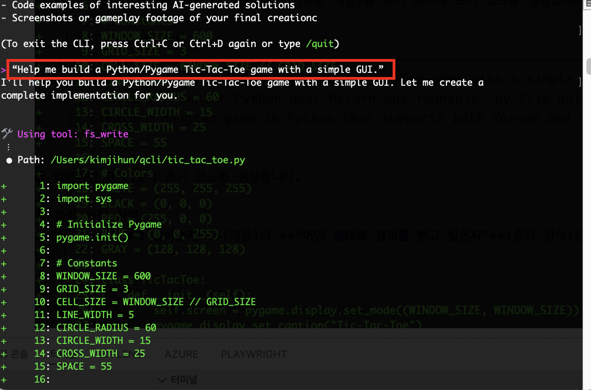
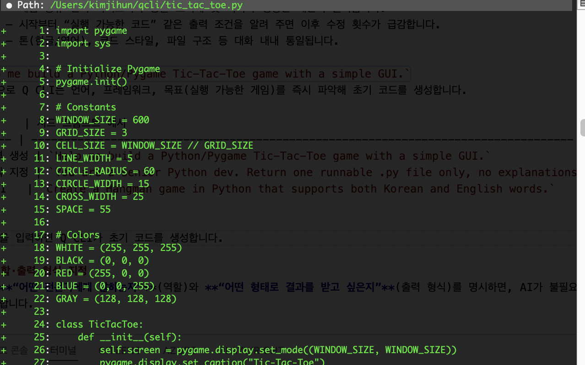
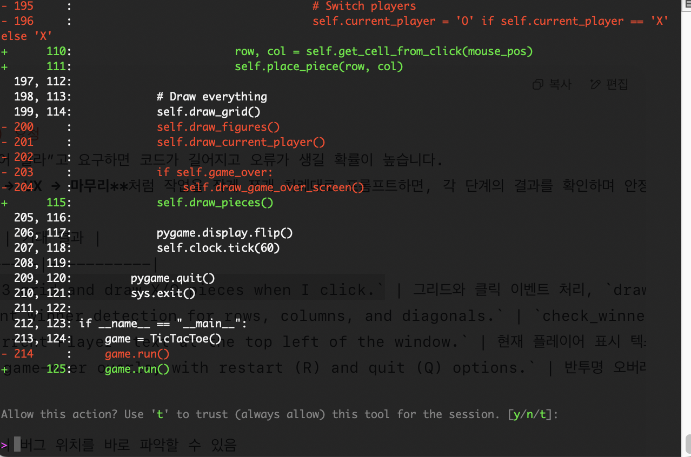
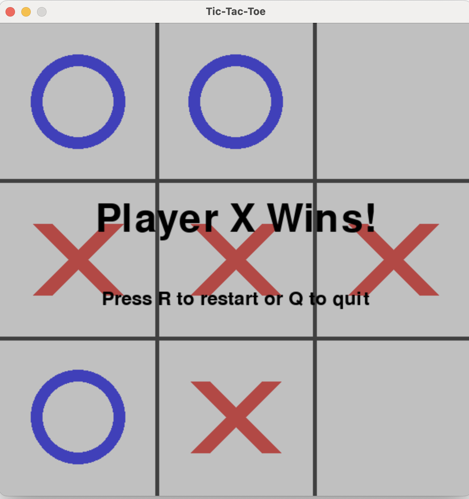

## Chosen Game and Rationale

| Item | Details |
|------|---------|
| Game | Tic-Tac-Toe |
| Platform / Library | Python 3 + Pygame |
| Why This Game? | – Simple rules let you start coding and iterating right away.<br>– Includes core game-dev elements—3×3 grid, mouse events, win detection—so Q CLI’s code-generation and refactoring abilities are easy to demonstrate.<br>– Small codebase means you can drop the entire file into the chat with `/context add` and edit it incrementally. |
| Learning & Expansion | – AI difficulty can be scaled by prompt alone (random ➜ minimax).<br>– Good sandbox for testing Pygame features like UI skins, animations, and sounds. |
| Blog / Video Friendly | – A single GIF frame conveys the whole game at a glance.<br>– One file (~300 LOC) keeps GitHub and blog embeds lightweight. |
| Q CLI Demo Value | – Step-by-step prompts—“Draw the grid → Add X/O pieces → Add a restart button”—clearly show the OPA loop and real-time feedback. |

> Tic-Tac-Toe is a **simple yet extensible** showcase that lets you experience the power of an AI agent with minimal overhead.

## Effective Prompt Techniques
When your prompts are **short and specific**, Q CLI understands your goal more precisely and the number of revision cycles drops dramatically.  
Following just three rules—**define a role → specify an output format → request tasks step-by-step**—lets you handle everything from initial code generation to refactoring and test automation through natural-language chat alone.

### 1. Seed Prompt  
{: .align-center}{: width="80%"}  

A **Seed Prompt** is the very first instruction that sets the **direction and scope** of the chat session.  
Like a *seed* that germinates, this line establishes the context from which every subsequent response or follow-up prompt grows.  

Tools such as Q CLI or ChatGPT store the goals, output format, and tone implied by the seed prompt and keep applying them throughout the conversation.  

#### Why is it important?
- **Clarify the goal** — Lock in game type, language, and library up front so the AI won’t wander.  
- **Reduce iterations** — Stating requirements like “runnable code” from the outset slashes later edits.  
- **Ensure consistency** — Tone (Korean/English), code style, and file structure remain uniform across replies.  

Example seed prompt:  
`Help me build a Python/Pygame Tic-Tac-Toe game with a simple GUI.`  
This single line tells Q CLI the language, framework, and end goal (a runnable game), and it immediately returns starter code.

| Purpose | Example Seed Prompt |
|---------|---------------------|
| Scaffold a project | `Help me build a Python/Pygame Tic-Tac-Toe game with a simple GUI.` |
| Specify output format | `You are a senior Python dev. Return one runnable .py file only, no explanations.` |
| Multi-language UI | `Create a Tic-Tac-Toe game in Python that supports both Korean and English words.` |

{: .align-center}{: width="80%"}  

After you enter the seed prompt, Q CLI generates the initial code locally.

### 2. Specify Role & Output Format
By stating **“which expert you’re addressing”** (role) and **“what form you want the output in”** (format), the AI replies in the exact style you need—without extra commentary.

```text
You are a Python game developer.
Return a single runnable .py file wrapped in triple backticks.
```

### 3. Step-by-Step (Chain) Prompts  
{: .align-center}{: width="80%" height="80%"}  

If you ask the AI to “add every feature at once,” the code becomes bloated and prone to errors.  
Instead, break the work into small chunks—**UI → game logic → UX → polish**—and prompt them sequentially, verifying each stage before moving on.

| Stage | Sample Prompt | Expected Result |
|-------|---------------|-----------------|
| ① UI | `Add a 3×3 grid and draw X/O pieces when I click.` | Grid and click handling, `draw_grid` / `draw_figures` functions added |
| ② Logic | `Implement winner detection for rows, columns, and diagonals.` | `check_winner` function implemented |
| ③ UX | `Show "Current Player" text at the top left of the window.` | Current-player label rendered |
| ④ Polish | `Add a game-over overlay with restart (R) and quit (Q) options.` | Semi-transparent overlay + key event handling |

**Benefits**  
1. Testing small units pinpoints bugs instantly.  
2. A simpler chat context reduces the chance of AI misunderstandings.  
3. You can easily drop features or reorder priorities on the fly.  

As in the Observe-Plan-Act (OPA) cycle explained in Part 1, you **review the result, plan the next step, and repeat** until the game is complete.

## Classic Programming Tasks Handled by AI

| Task | Hassle When Done Manually | How Q CLI Solved It |
|------|---------------------------|---------------------|
| Event loop setup | Manually code Pygame init, `while` loop, FPS cap | One seed prompt returns a ready-to-run loop |
| Win-detection logic | Check eight patterns with nested if-statements | Provides a 3×3 array scan using list comprehension |
| Pixel → cell mapping | Convert mouse coords to grid indices | Generates a `get_cell_from_mouse()` helper |
| Game-over screen | Build overlay, render text, handle key events | “Add game-over UI” prompt creates it instantly |
| Code refactoring | Split long functions, remove duplication by hand | “Refactor this” prompt → function extraction, better names |
| Dependency management | Document and run `pip install pygame` yourself | Detects missing lib and suggests auto-install snippet |

> Bottom line: **The AI agent took over the repetitive, boilerplate work**, freeing me to focus on gameplay ideas and UX polish.  


## Time Saved Through Automation

| Task Stage | Time Manually | With Q CLI | Time Saved |
|------------|---------------|------------|------------|
| Project scaffold (window, grid, loop) | ~20 min | Seed prompt → 30 sec | **–19 min** |
| Dependency install (pygame) | 5 min searching & documenting | Auto-install snippet: “If pygame is missing, install it” | **–5 min** |
| Win-detection logic | 10 min | “Implement winner detection” → 20 sec | **–9 min** |
| Game-over UI | 15 min | “Add a semi-transparent overlay…” → 40 sec | **–14 min** |
| Refactor & formatting | 10 min | “Run black” + auto function split | **–10 min** |
| Test cases | 15 min | “Write pytest cases…” → 30 sec | **–14 min** |

> Thanks to one-line prompts and the OPA loop, **over an hour** of repetitive work was eliminated.

## AI-Generated Code Example
```python
import pygame
import sys

# Initialize Pygame
pygame.init()

# Constants
WINDOW_SIZE = 600
GRID_SIZE = 3
CELL_SIZE = WINDOW_SIZE // GRID_SIZE
LINE_WIDTH = 5
CIRCLE_RADIUS = 60
CIRCLE_WIDTH = 15
CROSS_WIDTH = 25
SPACE = 55

# Colors
WHITE = (255, 255, 255)
BLACK = (0, 0, 0)
RED = (255, 0, 0)
BLUE = (0, 0, 255)

class TicTacToe:
    def __init__(self):
        self.screen = pygame.display.set_mode((WINDOW_SIZE, WINDOW_SIZE))
        pygame.display.set_caption("Tic-Tac-Toe")
        self.clock = pygame.time.Clock()
        
        # Game state - 3x3 grid
        self.board = [['' for _ in range(GRID_SIZE)] for _ in range(GRID_SIZE)]
        self.current_player = 'X'
        self.winner = None
        self.game_over = False
        
        # Font for winner display and current player
        self.font = pygame.font.Font(None, 74)
        self.small_font = pygame.font.Font(None, 36)
        
    def draw_grid(self):
        """Draw the 3x3 tic-tac-toe grid"""
        self.screen.fill(WHITE)
        
        # Draw vertical lines
        for i in range(1, GRID_SIZE):
            pygame.draw.line(
                self.screen, 
                BLACK, 
                (i * CELL_SIZE, 0), 
                (i * CELL_SIZE, WINDOW_SIZE), 
                LINE_WIDTH
            )
        
        # Draw horizontal lines
        for i in range(1, GRID_SIZE):
            pygame.draw.line(
                self.screen, 
                BLACK, 
                (0, i * CELL_SIZE), 
                (WINDOW_SIZE, i * CELL_SIZE), 
                LINE_WIDTH
            )
    
    def draw_pieces(self):
        """Draw X's and O's on the board"""
        for row in range(GRID_SIZE):
            for col in range(GRID_SIZE):
                if self.board[row][col] == 'X':
                    self.draw_x(row, col)
                elif self.board[row][col] == 'O':
                    self.draw_o(row, col)
    
    def draw_x(self, row, col):
        """Draw an X piece in the specified cell"""
        # Calculate cell center and draw diagonal lines
        start_desc = (col * CELL_SIZE + SPACE, row * CELL_SIZE + SPACE)
        end_desc = (col * CELL_SIZE + CELL_SIZE - SPACE, row * CELL_SIZE + CELL_SIZE - SPACE)
        pygame.draw.line(self.screen, RED, start_desc, end_desc, CROSS_WIDTH)
        
        start_asc = (col * CELL_SIZE + SPACE, row * CELL_SIZE + CELL_SIZE - SPACE)
        end_asc = (col * CELL_SIZE + CELL_SIZE - SPACE, row * CELL_SIZE + SPACE)
        pygame.draw.line(self.screen, RED, start_asc, end_asc, CROSS_WIDTH)
    
    def draw_o(self, row, col):
        """Draw an O piece in the specified cell"""
        center = (col * CELL_SIZE + CELL_SIZE // 2, row * CELL_SIZE + CELL_SIZE // 2)
        pygame.draw.circle(self.screen, BLUE, center, CIRCLE_RADIUS, CIRCLE_WIDTH)
    
    def get_cell_from_click(self, mouse_pos):
        """Convert mouse click position to grid cell coordinates"""
        x, y = mouse_pos
        row = y // CELL_SIZE
        col = x // CELL_SIZE
        return row, col
    
    def check_winner(self):
        """Check for winner in rows, columns, and diagonals"""
        # Check rows
        for row in range(GRID_SIZE):
            if (self.board[row][0] == self.board[row][1] == self.board[row][2] != ''):
                return self.board[row][0]
        
        # Check columns
        for col in range(GRID_SIZE):
            if (self.board[0][col] == self.board[1][col] == self.board[2][col] != ''):
                return self.board[0][col]
        
        # Check main diagonal (top-left to bottom-right)
        if (self.board[0][0] == self.board[1][1] == self.board[2][2] != ''):
            return self.board[0][0]
        
        # Check anti-diagonal (top-right to bottom-left)
        if (self.board[0][2] == self.board[1][1] == self.board[2][0] != ''):
            return self.board[0][2]
        
        return None
    
    def is_board_full(self):
        """Check if the board is completely filled"""
        for row in range(GRID_SIZE):
            for col in range(GRID_SIZE):
                if self.board[row][col] == '':
                    return False
        return True
    
    def place_piece(self, row, col):
        """Place current player's piece in the specified cell"""
        if (0 <= row < GRID_SIZE and 0 <= col < GRID_SIZE and 
            self.board[row][col] == '' and not self.game_over):
            
            self.board[row][col] = self.current_player
            
            # Check for winner after placing piece
            self.winner = self.check_winner()
            if self.winner:
                self.game_over = True
            elif self.is_board_full():
                self.game_over = True  # Tie game
            else:
                # Switch to next player
                self.current_player = 'O' if self.current_player == 'X' else 'X'
            
            return True
        return False
    
    def draw_current_player(self):
        """Display current player indicator at top left"""
        if not self.game_over:
            player_text = self.small_font.render(f"Current Player: {self.current_player}", True, BLACK)
            self.screen.blit(player_text, (10, 10))
    
    def draw_winner_message(self):
        """Display winner or tie message"""
        if self.game_over:
            if self.winner:
                text = self.font.render(f"Player {self.winner} Wins!", True, BLACK)
            else:
                text = self.font.render("It's a Tie!", True, BLACK)
            
            # Create semi-transparent background
            overlay = pygame.Surface((WINDOW_SIZE, WINDOW_SIZE))
            overlay.set_alpha(128)
            overlay.fill((200, 200, 200))
            self.screen.blit(overlay, (0, 0))
            
            # Center the text
            text_rect = text.get_rect(center=(WINDOW_SIZE // 2, WINDOW_SIZE // 2))
            self.screen.blit(text, text_rect)
    
    def run(self):
        """Main game loop"""
        running = True
        
        while running:
            for event in pygame.event.get():
                if event.type == pygame.QUIT:
                    running = False
                
                elif event.type == pygame.MOUSEBUTTONDOWN:
                    if event.button == 1:  # Left mouse button click
                        mouse_pos = pygame.mouse.get_pos()
                        row, col = self.get_cell_from_click(mouse_pos)
                        self.place_piece(row, col)
            
            # Draw everything
            self.draw_grid()
            self.draw_pieces()
            self.draw_current_player()
            self.draw_winner_message()
            
            pygame.display.flip()
            self.clock.tick(60)
        
        pygame.quit()
        sys.exit()

if __name__ == "__main__":
    game = TicTacToe()
    game.run()

```


## Final Result: Screenshot  
{: .align-center}{: width="80%" height="80%"}  
This is the final screenshot of the Tic-Tac-Toe game generated with Q CLI.

## Conclusion
Using Amazon Q CLI, we completed an entire game with the simple **prompt → code → run** workflow.

- **Productivity**: Repetitive, boilerplate tasks were automated by the AI, freeing us to focus on ideas and UX polish.  
- **Learning curve**: Mastering just the seed prompt and step-by-step (chain-of-thought) requests lets even beginners achieve practical results quickly.  
- **Scalability**: The same method can add an AI opponent (minimax), animations, sound, or a CI/CD pipeline—all driven by natural-language instructions.  
- **Agent value**: Q CLI proved to be more than a standard LLM chatbot; by continuously applying the Observe-Plan-Act loop, it served as an **active coding partner** in its own right.
